# CompTIA DataSys+ DS0-001 Visual Study Diagrams

All diagrams use [Mermaid](https://mermaid.js.org/) syntax — renders natively in GitHub, VS Code (with Markdown Preview Mermaid extension), and most modern Markdown viewers.

---

## Exam Overview

### Domain Weight Distribution

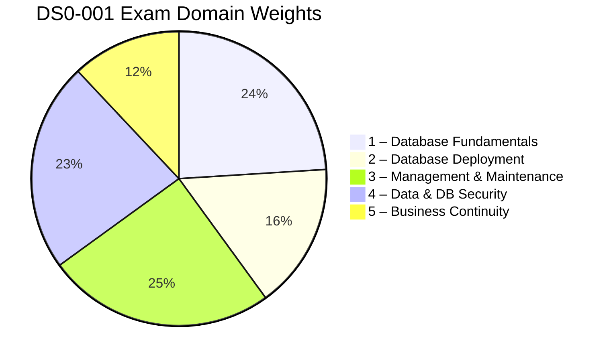

### Study Path

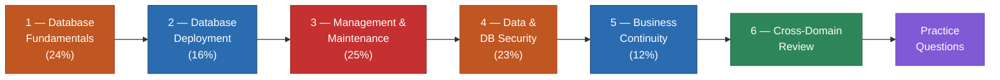

### Objective Verb → Question Style

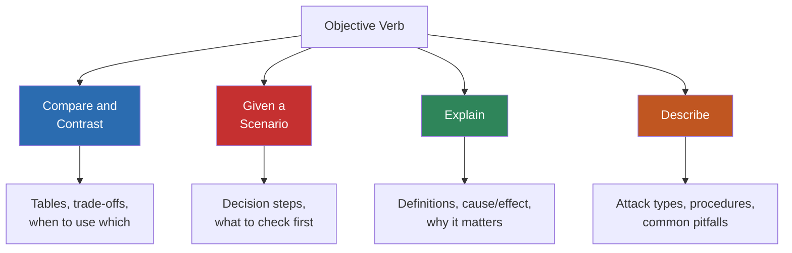

---

## Domain 1 — Database Fundamentals (24%)

### Database Type Taxonomy

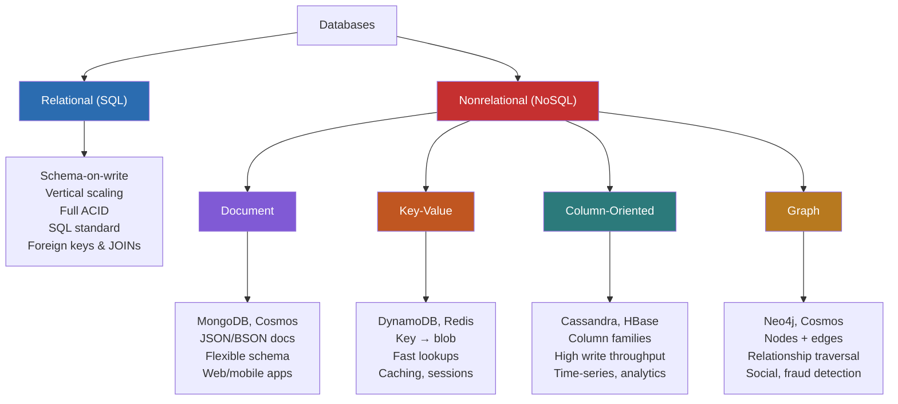

### Linear vs Non-Linear Data Formats

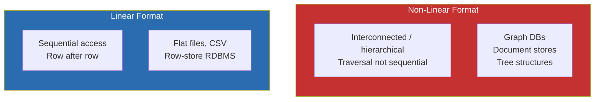

### SQL Sublanguages

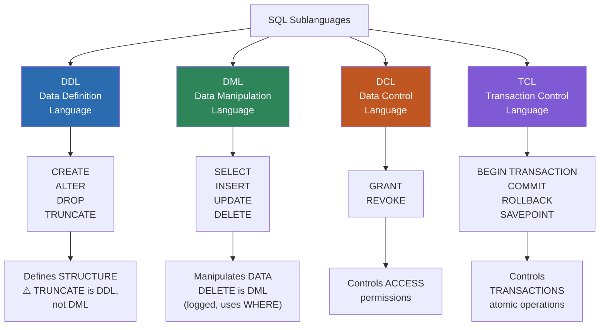

### ACID Properties

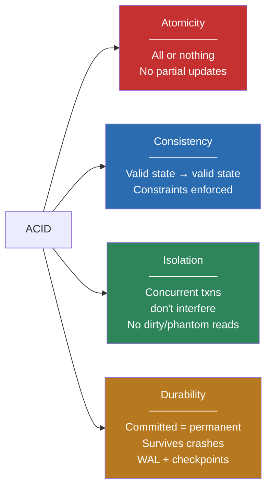

### SQL Programming Objects — Decision Flowchart

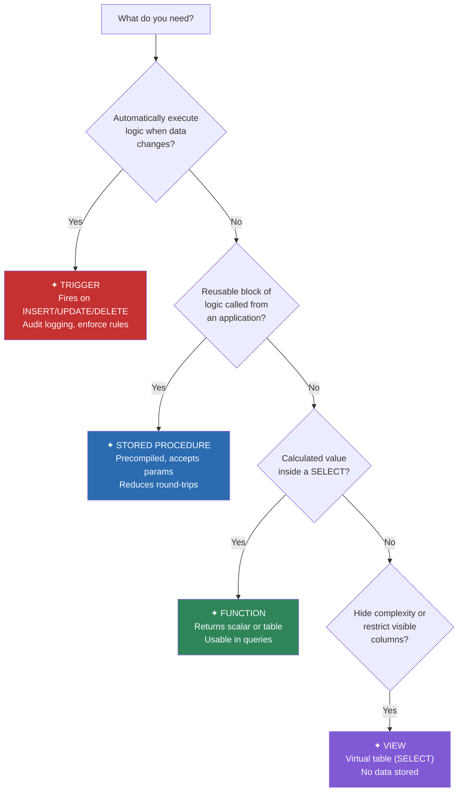

### ORM Impact Assessment — Ordered Process

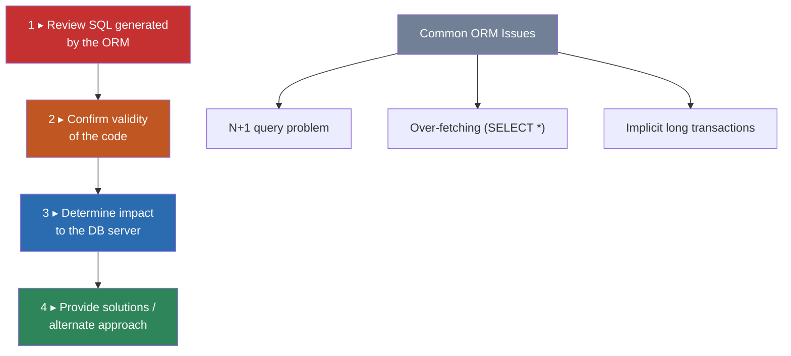

### Server-Side vs Client-Side Scripting

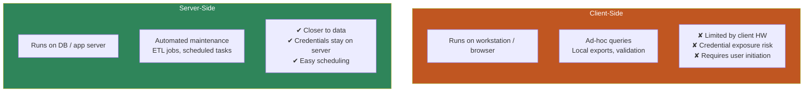

### Database Planning & Design

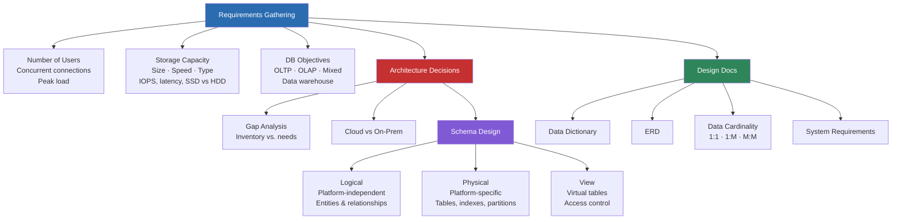

---

## Domain 2 — Database Deployment (16%)

### Cloud Hosting Models — Who Manages What?

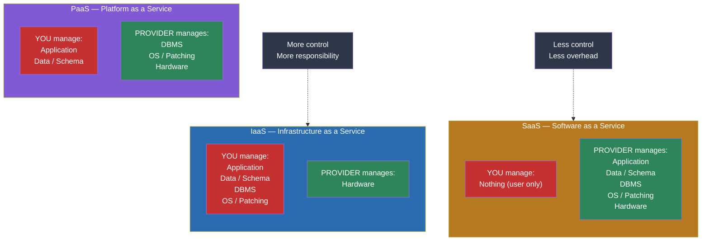

### Deployment Phases — Ordered Process

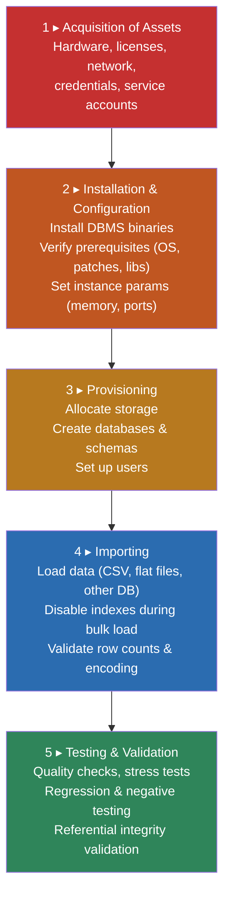

### Database Connectivity Architecture

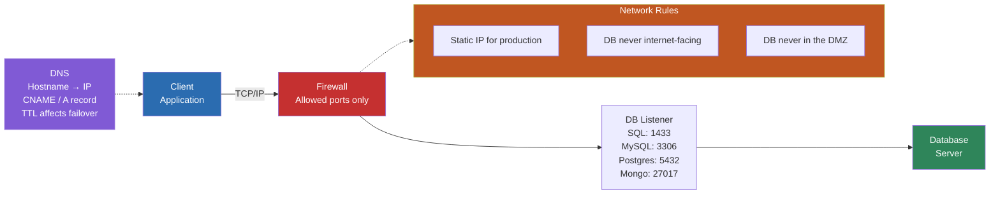

### Testing & Validation Types

```mermaid
flowchart TD
    TEST["Testing"] --> QC["DB Quality Check<br/>Columns/tables match spec"]
    TEST --> CE["Code Execution<br/>Procs, functions, triggers"]
    TEST --> SM["Schema Meets<br/>Requirements"]
    TEST --> SYN["Syntax Errors<br/>Scripts parse cleanly"]
    TEST --> STR["Stress Testing<br/>Proc stress + app load"]
    TEST --> NT["Notification Triggers<br/>Alerts fire correctly"]
    TEST --> VC["Version Control<br/>Migrations apply clean"]
    TEST --> REG["Regression Testing<br/>Existing features work"]
    TEST --> NEG["Negative Testing<br/>⚠ Bad data handled<br/>gracefully"]

    VAL["Validation"] --> IDX["Index Analysis"]
    VAL --> DM["Data Mapping<br/>Source → target"]
    VAL --> DV["Data Values<br/>NULLs, truncation, encoding"]
    VAL --> QR["Queries<br/>Correct results, good perf"]
    VAL --> RI["Referential Integrity<br/>No orphan records"]
    VAL --> SV["Scalability<br/>Handles projected growth"]

    style TEST fill:#2B6CB0,color:#fff
    style VAL fill:#2F855A,color:#fff
    style NEG fill:#C53030,color:#fff
```

---

## Domain 3 — Management & Maintenance (25%)

### Monitoring & Alerting Overview

```mermaid
flowchart TD
    MON["Database Monitoring"] --> RES["Resource Utilization"]
    MON --> PERF["Performance"]
    MON --> JOBS["Job Monitoring"]
    MON --> SEC["Security Signals"]
    MON --> REP["Replication"]

    RES --> CPU["CPU<br/>Sustained high =<br/>missing indexes or<br/>bad plans"]
    RES --> MEM["Memory<br/>Buffer pool hit ratio<br/>Page life expectancy"]
    RES --> DISK["Disk Space<br/>I/O latency<br/>Queue depth"]
    RES --> OS["OS Performance<br/>Context switches<br/>Page faults"]

    PERF --> TP["Throughput<br/>TPS / QPS"]
    PERF --> DU["Daily Usage<br/>Establish baseline<br/>Spot deviations"]
    PERF --> GR["Growth Trends<br/>Storage limits<br/>Capacity planning"]

    JOBS --> JC["Job Completion<br/>Backups, ETL,<br/>index rebuilds"]
    JOBS --> BAK["Backup Alerts<br/>Missed / failed / slow<br/>File size anomalies"]
    JOBS --> LOGS["Log Files<br/>Transaction logs<br/>System logs"]

    SEC --> DL["Deadlocks<br/>Frequency & objects<br/>Design issues"]
    SEC --> CONN["Connections<br/>Concurrent sessions<br/>Failed attempts"]

    REP --> LAG["Replication Lag<br/>Seconds/txns behind"]
    REP --> ERR["Replication Errors<br/>Broken chains"]
    REP --> CONS["Data Consistency<br/>Primary vs replicas"]

    BL["BASELINE<br/>'Normal' metrics snapshot<br/>Required to detect anomalies"]
    BL -.-> MON

    style MON fill:#2B6CB0,color:#fff
    style RES fill:#C53030,color:#fff
    style PERF fill:#C05621,color:#fff
    style JOBS fill:#805AD5,color:#fff
    style SEC fill:#2C7A7B,color:#fff
    style REP fill:#B7791F,color:#fff
    style BL fill:#2D3748,color:#fff
```

### Index Optimization

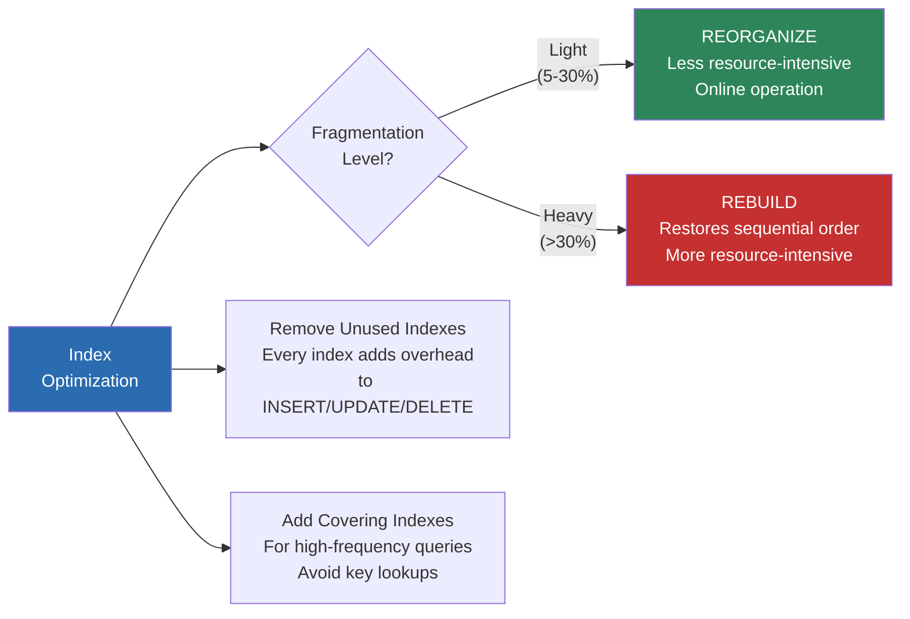

### Patch Management


### Change Management — Ordered Process

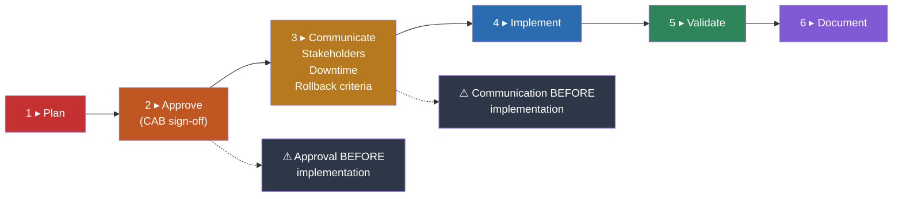

### Documentation Types

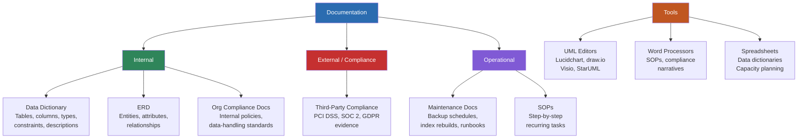

### View vs Materialized View

```mermaid
flowchart LR
    subgraph VIEW["VIEW"]
        direction TB
        V1["Virtual table"]
        V2["No data stored"]
        V3["Always current"]
        V4["Runs SELECT every time"]
        V5["Best for: simplifying access,<br/>restricting columns"]
    end

    subgraph MATVIEW["MATERIALIZED VIEW"]
        direction TB
        M1["Physically stored snapshot"]
        M2["Data stored on disk"]
        M3["Stale until refreshed"]
        M4["Precomputed results"]
        M5["Best for: expensive aggregations<br/>queried frequently"]
    end

    VIEW ~~~ MATVIEW

    style VIEW fill:#2B6CB0,color:#fff
    style MATVIEW fill:#C53030,color:#fff
```

---

## Domain 4 — Data & Database Security (23%)

### Encryption — Data States

```mermaid
flowchart TD
    ENC["Encryption"] --> TRANSIT["Data in Transit<br/>(Moving across network)"]
    ENC --> REST["Data at Rest<br/>(Stored on disk)"]

    TRANSIT --> CSE["Client-Side Encryption<br/>App encrypts before sending"]
    TRANSIT --> ITE["In-Transit Encryption<br/>TLS/SSL channel"]
    TRANSIT --> SSE["Server-Side Encryption<br/>Server encrypts on receipt"]

    REST --> TDE["Transparent Data<br/>Encryption (TDE)<br/>Encrypts DB files<br/>Queries see plaintext"]
    REST --> CLE["Column-Level<br/>Encryption<br/>Granular, specific columns<br/>Higher app complexity"]
    REST --> FDE["Full-Disk Encryption<br/>OS-level (BitLocker, LUKS)<br/>Entire volume"]

    style ENC fill:#2D3748,color:#fff
    style TRANSIT fill:#2B6CB0,color:#fff
    style REST fill:#C53030,color:#fff
```

### Data Masking

```mermaid
flowchart LR
    subgraph STATIC["Static Masking"]
        direction TB
        S1["Applied to non-production<br/>copies"]
        S2["Permanent alteration"]
        S3["Production data unchanged"]
        S4["Use: safe dev/test<br/>environments"]
    end

    subgraph DYNAMIC["Dynamic Masking"]
        direction TB
        D1["Applied at query time<br/>in production"]
        D2["Production data unchanged"]
        D3["Role-based: different users<br/>see different levels"]
        D4["Use: role-based access<br/>in production"]
    end

    DISC["Data Discovery<br/>(must happen FIRST)<br/>Scan to find<br/>PII, PHI, PCI data"]
    DISC --> STATIC
    DISC --> DYNAMIC

    style STATIC fill:#2B6CB0,color:#fff
    style DYNAMIC fill:#805AD5,color:#fff
    style DISC fill:#C53030,color:#fff
```

### Data Destruction Techniques

```mermaid
flowchart LR
    DEST["Data<br/>Destruction"] --> LOG["Logical Deletion<br/>Soft delete<br/>(mark as deleted)<br/>Recoverable"]
    DEST --> PHYS["Physical Deletion<br/>DELETE / TRUNCATE<br/>Recoverable from<br/>backups/forensics"]
    DEST --> CRYPTO["Cryptographic Erasure<br/>Destroy encryption key<br/>Data permanently<br/>unreadable"]
    DEST --> MEDIA["Media Sanitization<br/>Degaussing, overwriting<br/>Physical destruction"]

    LOG -.->|"Least permanent"| PHYS -.->|"More permanent"| CRYPTO -.->|"Most permanent"| MEDIA

    style LOG fill:#2F855A,color:#fff
    style PHYS fill:#B7791F,color:#fff
    style CRYPTO fill:#C05621,color:#fff
    style MEDIA fill:#C53030,color:#fff
```

### Data Classification

```mermaid
flowchart TD
    CLASS["Data Classification"] --> PII
    CLASS --> PHI
    CLASS --> PCI

    PII["PII<br/>Personally Identifiable<br/>Information"]
    PII --> PII_D["Name, SSN, email<br/>address, date of birth"]
    PII --> PII_G["Governed by: various<br/>state/federal privacy laws"]

    PHI["PHI<br/>Personal Health<br/>Information"]
    PHI --> PHI_D["Medical records, diagnoses<br/>insurance IDs"]
    PHI --> PHI_G["Governed by: HIPAA"]

    PCI["PCI DSS<br/>Payment Card Industry<br/>Data Security Standard"]
    PCI --> PCI_D["Card number, CVV<br/>cardholder name, expiration"]
    PCI --> PCI_G["Governed by: PCI SSC<br/>Quarterly scans required"]

    style PII fill:#2B6CB0,color:#fff
    style PHI fill:#2F855A,color:#fff
    style PCI fill:#C05621,color:#fff
```

### Access Control — Decision Flow

```mermaid
flowchart TD
    START["User needs<br/>access"] --> Q1{"What does the<br/>user need to do?"}

    Q1 -->|"Read data"| SEL["Grant SELECT only"]
    Q1 -->|"Modify data"| DML_P["Grant INSERT /<br/>UPDATE / DELETE"]
    Q1 -->|"Manage schema"| DDL_P["Grant DDL<br/>permissions"]

    SEL --> ROLE["Assign via ROLE<br/>(e.g., read_only_analysts)"]
    DML_P --> ROLE
    DDL_P --> ROLE

    ROLE --> LP["Apply LEAST PRIVILEGE<br/>Never grant db_owner<br/>or sysadmin for<br/>routine tasks"]

    LP --> REVIEW["Periodic Review<br/>Remove expired accounts<br/>Rotate service account<br/>passwords"]

    PWD["Password Policies"]
    PWD --> COMP["Complexity<br/>Min length + char mix"]
    PWD --> EXP["Expiration<br/>Rotate every 90 days"]
    PWD --> HIST["History<br/>Prevent reuse"]
    PWD --> LOCK["Lockout<br/>After N failed attempts"]

    style START fill:#2B6CB0,color:#fff
    style LP fill:#C53030,color:#fff
    style ROLE fill:#2F855A,color:#fff
    style PWD fill:#805AD5,color:#fff
```

### Infrastructure Security — Physical + Logical

```mermaid
flowchart TD
    SEC["Infrastructure<br/>Security"] --> PHYS["Physical Security"]
    SEC --> LOGIC["Logical Security"]

    PHYS --> AC["Access Control<br/>Locked rooms<br/>Badge readers<br/>Mantraps"]
    PHYS --> BIO["Biometrics<br/>Fingerprint<br/>Retinal scan"]
    PHYS --> SURV["Surveillance<br/>CCTV cameras<br/>Forensic review"]
    PHYS --> FIRE["Fire Suppression<br/>Clean-agent (FM-200)<br/>Smoke detection"]
    PHYS --> COOL["Cooling Systems<br/>HVAC<br/>Precision cooling"]

    LOGIC --> FW["Firewall<br/>Filter by IP, port,<br/>protocol"]
    LOGIC --> DMZ["Perimeter Network<br/>(DMZ)<br/>Web servers here<br/>⚠ DB NEVER here"]
    LOGIC --> PORT["Port Security<br/>Close unused ports<br/>Change defaults"]

    style PHYS fill:#C53030,color:#fff
    style LOGIC fill:#2B6CB0,color:#fff
    style DMZ fill:#C05621,color:#fff
```

### Attack Types & Mitigations

```mermaid
flowchart TD
    ATK["Attacks on<br/>Data Systems"] --> SQLI & DOS & ONPATH & BRUTE & PHISH & RANSOM

    SQLI["SQL Injection<br/>' OR 1=1 --<br/>Targets DB through app"]
    SQLI --> SQLI_M["✦ Parameterized queries<br/>✦ Input validation<br/>✦ Least-privilege accounts<br/>✦ WAF"]

    DOS["Denial of Service<br/>Overwhelm with<br/>traffic/requests"]
    DOS --> DOS_M["✦ Rate limiting<br/>✦ Connection throttling<br/>✦ Load balancing"]

    ONPATH["On-Path<br/>(Man-in-the-Middle)<br/>Intercepts client↔server"]
    ONPATH --> ONPATH_M["✦ TLS/SSL encryption<br/>✦ Certificate pinning<br/>✦ Mutual authentication"]

    BRUTE["Brute Force<br/>Automated repeated<br/>login attempts"]
    BRUTE --> BRUTE_M["✦ Account lockout<br/>✦ Strong passwords<br/>✦ MFA"]

    PHISH["Phishing<br/>Social engineering<br/>Fake emails/websites"]
    PHISH --> PHISH_M["✦ Security training<br/>✦ MFA<br/>✦ Email filtering"]

    RANSOM["Ransomware<br/>Encrypts DB files<br/>Demands payment"]
    RANSOM --> RANSOM_M["✦ Offline/immutable backups<br/>✦ Endpoint protection<br/>✦ Network segmentation"]

    style ATK fill:#2D3748,color:#fff
    style SQLI fill:#C53030,color:#fff
    style DOS fill:#C05621,color:#fff
    style ONPATH fill:#B7791F,color:#fff
    style BRUTE fill:#805AD5,color:#fff
    style PHISH fill:#2B6CB0,color:#fff
    style RANSOM fill:#2C7A7B,color:#fff
```

---

## Domain 5 — Business Continuity (12%)

### DR Techniques — RPO / RTO Comparison

```mermaid
flowchart TD
    DR["DR Techniques"] --> SYNC & ASYNC & LOGSHIP & HA

    SYNC["Synchronous<br/>Replication / Mirroring<br/>───────<br/>RPO: Near-zero<br/>RTO: Seconds<br/>⚠ Adds write latency<br/>(waits for ack)"]

    ASYNC["Asynchronous<br/>Replication / Mirroring<br/>───────<br/>RPO: Seconds–minutes<br/>RTO: Seconds–minutes<br/>✔ Faster writes<br/>⚠ Risk of recent data loss"]

    LOGSHIP["Log Shipping<br/>───────<br/>RPO: Minutes–hours<br/>RTO: Minutes–hours<br/>✔ Cheapest<br/>⚠ Highest data-loss risk"]

    HA["HA Clustering<br/>───────<br/>RPO: Near-zero<br/>RTO: Near-zero<br/>✔ Minimal downtime<br/>⚠ Most complex & expensive"]

    style SYNC fill:#2F855A,color:#fff
    style ASYNC fill:#2B6CB0,color:#fff
    style LOGSHIP fill:#C05621,color:#fff
    style HA fill:#805AD5,color:#fff
```

### RPO vs RTO

```mermaid
flowchart LR
    subgraph RPO_BOX["RPO — Recovery Point Objective"]
        direction TB
        RPO_Q["'How much data can we lose?'"]
        RPO_D["Drives BACKUP FREQUENCY<br/>RPO = 1 hour → backups<br/>at least every hour"]
    end

    subgraph RTO_BOX["RTO — Recovery Time Objective"]
        direction TB
        RTO_Q["'How fast must we recover?'"]
        RTO_D["Drives ARCHITECTURE<br/>RTO = minutes → HA / hot standby<br/>Cold restore won't meet it"]
    end

    RPO_BOX ~~~ RTO_BOX

    style RPO_BOX fill:#C53030,color:#fff
    style RTO_BOX fill:#2B6CB0,color:#fff
```

### Backup Types Comparison

```mermaid
flowchart TD
    FULL["FULL Backup<br/>───────<br/>Captures: entire database<br/>Restore: full only (1 file)<br/>Speed: fastest restore<br/>Size: largest"]

    DIFF["DIFFERENTIAL Backup<br/>───────<br/>Captures: changes since<br/>last FULL<br/>Restore: full + latest diff<br/>(2 files)<br/>Grows between fulls"]

    INCR["INCREMENTAL Backup<br/>───────<br/>Captures: changes since<br/>last backup (any type)<br/>Restore: full + EVERY incr<br/>in sequence (N files)<br/>Smallest individual files"]

    FULL -->|"Base for"| DIFF
    FULL -->|"Base for"| INCR
    DIFF -.->|"References"| FULL
    INCR -.->|"References"| PREV["Previous backup<br/>(full or incremental)"]

    TRAP["⚠ EXAM TRAP<br/>Differential = since last FULL<br/>Incremental = since last BACKUP<br/>Diff restore = 2 files (simpler)<br/>Incr restore = N files (slowest)"]

    style FULL fill:#2F855A,color:#fff
    style DIFF fill:#2B6CB0,color:#fff
    style INCR fill:#C05621,color:#fff
    style TRAP fill:#C53030,color:#fff
```

### Backup Best Practices

```mermaid
flowchart TD
    BP["Backup Best<br/>Practices"] --> SCHED["Schedule & Automate<br/>Full → Diff/Incr → Log<br/>Align with RPO"]
    BP --> TEST["Test Restores<br/>A backup never restored<br/>is a hope, not a backup"]
    BP --> HASH["Validate Hash<br/>SHA-256 / MD5 at creation<br/>Compare before restore<br/>Mismatch = corruption"]
    BP --> LOC["Storage Location"]
    BP --> RET["Retention Policy"]

    LOC --> ONSITE["On-Site<br/>✔ Fast restore<br/>✘ Same disaster risk"]
    LOC --> OFFSITE["Off-Site<br/>✔ Survives local disaster<br/>✘ Slower restore"]
    LOC --> RULE["3-2-1 Rule<br/>3 copies<br/>2 media types<br/>1 off-site"]

    RET --> PURGE["Purge<br/>Delete after retention<br/>period expires"]
    RET --> ARCHIVE["Archive<br/>Move to cold storage<br/>For regulatory holds"]

    style BP fill:#2B6CB0,color:#fff
    style RULE fill:#C53030,color:#fff
```

### Failback to Normal Operations — Ordered Process

```mermaid
flowchart TD
    F1["1 ▸ Verify primary<br/>environment restored<br/>and healthy"]
    F2["2 ▸ Resynchronize data<br/>from DR site<br/>to primary"]
    F3["3 ▸ Validate data integrity<br/>Row counts, checksums,<br/>referential integrity"]
    F4["4 ▸ Switch traffic to primary<br/>DNS change,<br/>connection strings,<br/>load balancer"]
    F5["5 ▸ Monitor for stability<br/>Defined observation<br/>period"]
    F6["6 ▸ Update DR documentation<br/>Lessons learned"]

    F1 --> F2 --> F3 --> F4 --> F5 --> F6

    style F1 fill:#C53030,color:#fff
    style F2 fill:#C05621,color:#fff
    style F3 fill:#B7791F,color:#fff
    style F4 fill:#2B6CB0,color:#fff
    style F5 fill:#2F855A,color:#fff
    style F6 fill:#805AD5,color:#fff
```

### DR Plan Testing Types

```mermaid
flowchart LR
    TT["DR Testing"] --> TAB["Tabletop Exercise<br/>───────<br/>Walk-through on paper<br/>✔ Low cost<br/>✔ Catches procedural gaps<br/>✘ No technical validation"]
    TT --> SIM["Simulation<br/>───────<br/>Simulate failure<br/>in test environment<br/>✔ Validates technical steps<br/>✔ Medium cost"]
    TT --> FULL["Full Failover Test<br/>───────<br/>Actually fail over<br/>to DR site<br/>✔ Highest confidence<br/>⚠ Highest risk & cost"]

    style TAB fill:#2F855A,color:#fff
    style SIM fill:#2B6CB0,color:#fff
    style FULL fill:#C53030,color:#fff
```

---

## Cross-Domain — Key Distinctions

### TRUNCATE vs DELETE

```mermaid
flowchart LR
    subgraph TRUNC["TRUNCATE"]
        direction TB
        T1["DDL statement"]
        T2["Removes ALL rows"]
        T3["Cannot use WHERE"]
        T4["Minimal logging"]
        T5["Faster"]
        T6["Keeps table structure"]
    end

    subgraph DEL["DELETE"]
        direction TB
        D1["DML statement"]
        D2["Can remove specific rows"]
        D3["Uses WHERE clause"]
        D4["Fully logged"]
        D5["Slower (row-by-row)"]
        D6["Can fire triggers"]
    end

    TRUNC ~~~ DEL

    style TRUNC fill:#C53030,color:#fff
    style DEL fill:#2B6CB0,color:#fff
```

### Relational vs NoSQL — Quick Reference

```mermaid
flowchart LR
    subgraph RSQL["Relational (SQL)"]
        direction TB
        R1["Schema-on-write"]
        R2["Vertical scaling"]
        R3["Full ACID"]
        R4["Foreign keys + JOINs"]
        R5["Structured, transactional"]
        R6["Regulatory compliance"]
    end

    subgraph NOSQL["NoSQL"]
        direction TB
        N1["Schema-on-read"]
        N2["Horizontal scaling"]
        N3["Eventual consistency (BASE)"]
        N4["Denormalized"]
        N5["High velocity / volume"]
        N6["Semi/unstructured data"]
    end

    RSQL ~~~ NOSQL

    style RSQL fill:#2B6CB0,color:#fff
    style NOSQL fill:#C53030,color:#fff
```

### Security Audit Checklist — Ordered Process

```mermaid
flowchart TD
    SA1["1 ▸ Check expired / dormant accounts"]
    SA2["2 ▸ Review connection request logs"]
    SA3["3 ▸ Audit SQL code for injection vulnerabilities"]
    SA4["4 ▸ Verify credential storage<br/>(no plaintext, no hardcoded strings)"]
    SA5["5 ▸ Confirm password policies enforced"]
    SA6["6 ▸ Validate least privilege on<br/>all service accounts"]

    SA1 --> SA2 --> SA3 --> SA4 --> SA5 --> SA6

    style SA1 fill:#C53030,color:#fff
    style SA2 fill:#C05621,color:#fff
    style SA3 fill:#B7791F,color:#fff
    style SA4 fill:#2B6CB0,color:#fff
    style SA5 fill:#2F855A,color:#fff
    style SA6 fill:#805AD5,color:#fff
```

### Concept Thread Map — Where Topics Appear Across Domains

```mermaid
flowchart LR
    subgraph D1["Domain 1<br/>Fundamentals"]
        D1_A["SQL syntax<br/>Programming objects<br/>Schema levels<br/>ERD & Data Dict"]
    end

    subgraph D2["Domain 2<br/>Deployment"]
        D2_A["Build physical schema<br/>Prerequisites<br/>Connectivity<br/>Testing"]
    end

    subgraph D3["Domain 3<br/>Maintenance"]
        D3_A["Monitor & alert<br/>Optimize indexes<br/>Change management<br/>Documentation"]
    end

    subgraph D4["Domain 4<br/>Security"]
        D4_A["Encryption<br/>Access control<br/>Compliance<br/>Attack types"]
    end

    subgraph D5["Domain 5<br/>Continuity"]
        D5_A["DR techniques<br/>Backup types<br/>RPO/RTO<br/>Failover/failback"]
    end

    D1 --> D2 --> D3
    D3 --> D4
    D3 --> D5
    D4 --> D5

    style D1 fill:#C05621,color:#fff
    style D2 fill:#2B6CB0,color:#fff
    style D3 fill:#C53030,color:#fff
    style D4 fill:#C05621,color:#fff
    style D5 fill:#2B6CB0,color:#fff
```

### Default Database Ports — Quick Reference

```mermaid
flowchart LR
    PORTS["Default<br/>DB Ports"] --> SQL["SQL Server<br/>1433/TCP"]
    PORTS --> MY["MySQL<br/>3306/TCP"]
    PORTS --> PG["PostgreSQL<br/>5432/TCP"]
    PORTS --> MG["MongoDB<br/>27017/TCP"]

    style PORTS fill:#2D3748,color:#fff
    style SQL fill:#C53030,color:#fff
    style MY fill:#2B6CB0,color:#fff
    style PG fill:#2F855A,color:#fff
    style MG fill:#805AD5,color:#fff
```
