# CompTIA DataSys+ DS0-001 Visual Study Diagrams

All diagrams use [Mermaid](https://mermaid.js.org/) syntax — renders natively in GitHub, VS Code (with Markdown Preview Mermaid extension), and most modern Markdown viewers.

---

## Exam Overview

### Domain Weight Distribution

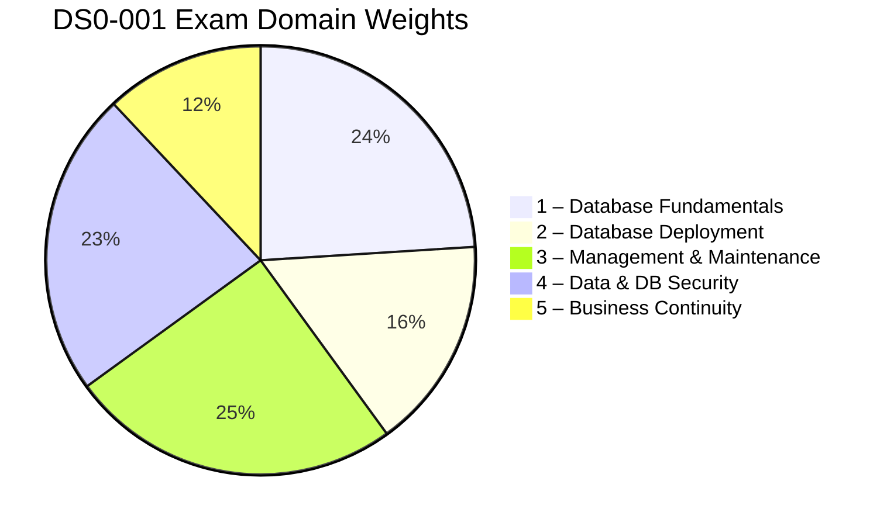

### Study Path


### Objective Verb → Question Style

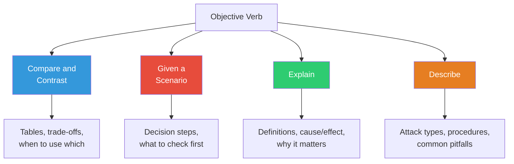

---

## Domain 1 — Database Fundamentals (24%)

### Database Type Taxonomy

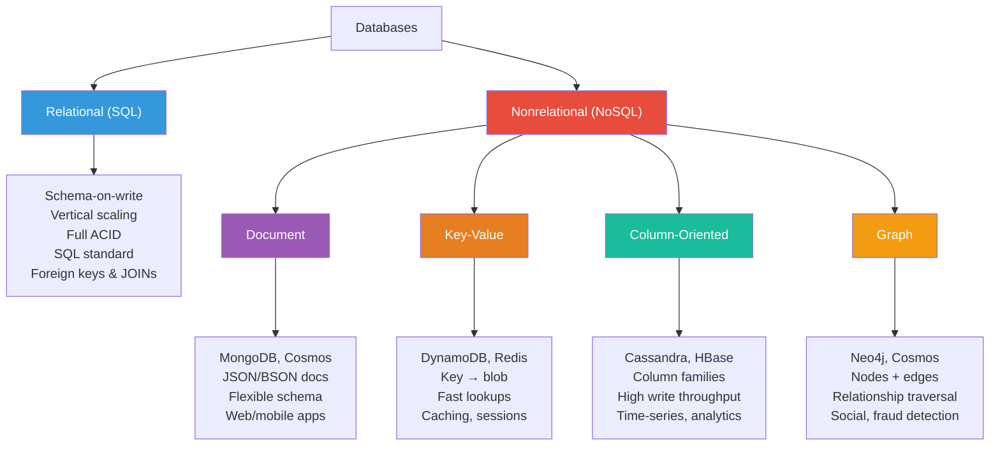

### Linear vs Non-Linear Data Formats

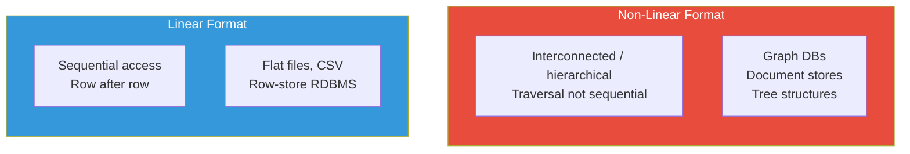

### SQL Sublanguages

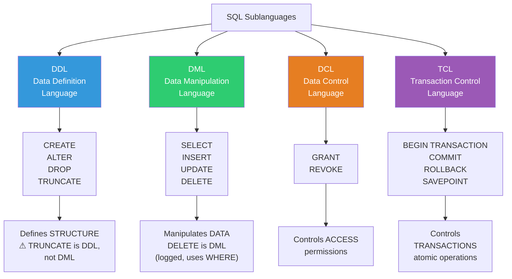

### ACID Properties

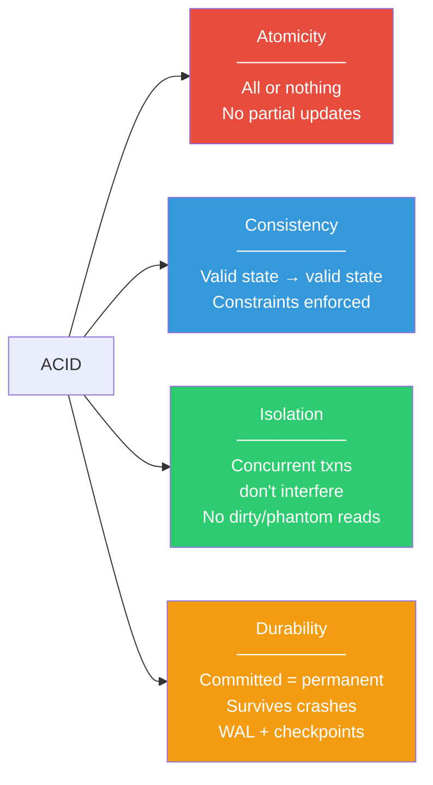

### SQL Programming Objects — Decision Flowchart

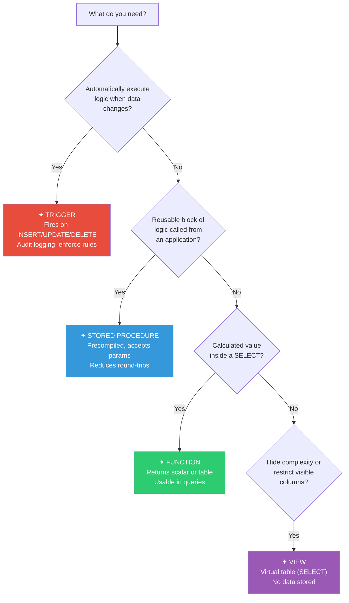

### ORM Impact Assessment — Ordered Process

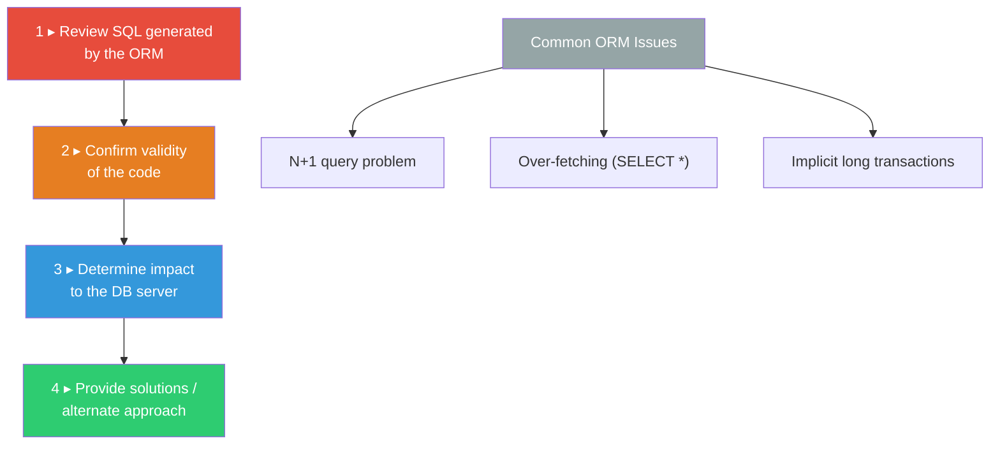

### Server-Side vs Client-Side Scripting

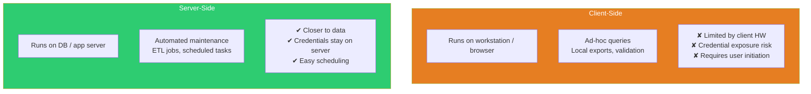

### Database Planning & Design

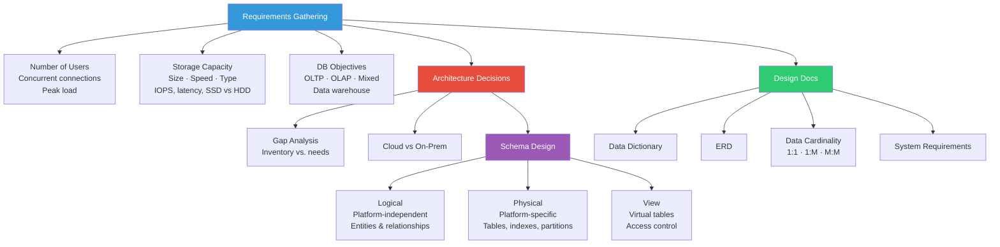

---

## Domain 2 — Database Deployment (16%)

### Cloud Hosting Models — Who Manages What?

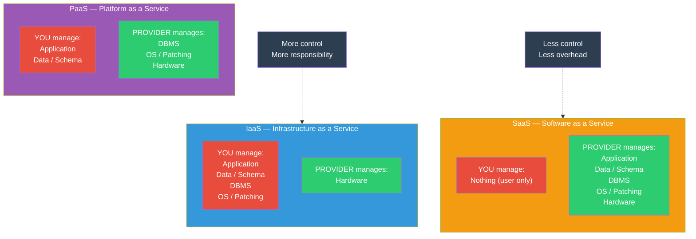

### Deployment Phases — Ordered Process

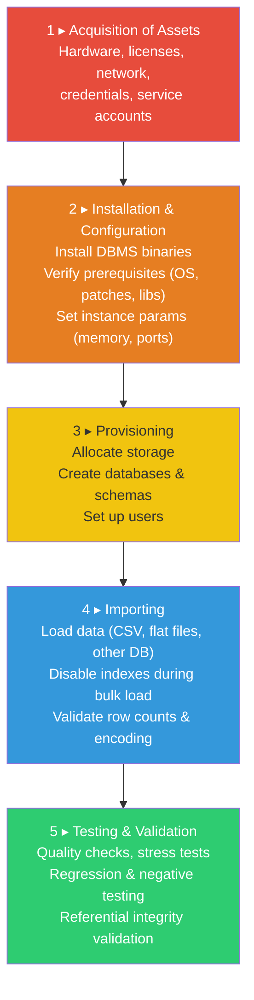

### Database Connectivity Architecture

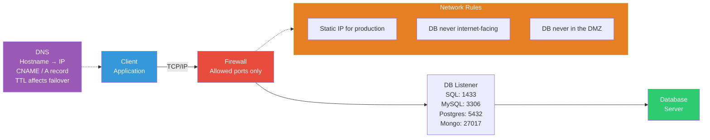

### Testing & Validation Types

```mermaid
flowchart TD
    TEST["Testing"] --> QC["DB Quality Check\nColumns/tables match spec"]
    TEST --> CE["Code Execution\nProcs, functions, triggers"]
    TEST --> SM["Schema Meets\nRequirements"]
    TEST --> SYN["Syntax Errors\nScripts parse cleanly"]
    TEST --> STR["Stress Testing\nProc stress + app load"]
    TEST --> NT["Notification Triggers\nAlerts fire correctly"]
    TEST --> VC["Version Control\nMigrations apply clean"]
    TEST --> REG["Regression Testing\nExisting features work"]
    TEST --> NEG["Negative Testing\n⚠ Bad data handled\ngracefully"]

    VAL["Validation"] --> IDX["Index Analysis"]
    VAL --> DM["Data Mapping\nSource → target"]
    VAL --> DV["Data Values\nNULLs, truncation, encoding"]
    VAL --> QR["Queries\nCorrect results, good perf"]
    VAL --> RI["Referential Integrity\nNo orphan records"]
    VAL --> SV["Scalability\nHandles projected growth"]

    style TEST fill:#3498db,color:#fff
    style VAL fill:#2ecc71,color:#fff
    style NEG fill:#e74c3c,color:#fff
```

---

## Domain 3 — Management & Maintenance (25%)

### Monitoring & Alerting Overview

```mermaid
flowchart TD
    MON["Database Monitoring"] --> RES["Resource Utilization"]
    MON --> PERF["Performance"]
    MON --> JOBS["Job Monitoring"]
    MON --> SEC["Security Signals"]
    MON --> REP["Replication"]

    RES --> CPU["CPU\nSustained high =\nmissing indexes or\nbad plans"]
    RES --> MEM["Memory\nBuffer pool hit ratio\nPage life expectancy"]
    RES --> DISK["Disk Space\nI/O latency\nQueue depth"]
    RES --> OS["OS Performance\nContext switches\nPage faults"]

    PERF --> TP["Throughput\nTPS / QPS"]
    PERF --> DU["Daily Usage\nEstablish baseline\nSpot deviations"]
    PERF --> GR["Growth Trends\nStorage limits\nCapacity planning"]

    JOBS --> JC["Job Completion\nBackups, ETL,\nindex rebuilds"]
    JOBS --> BAK["Backup Alerts\nMissed / failed / slow\nFile size anomalies"]
    JOBS --> LOGS["Log Files\nTransaction logs\nSystem logs"]

    SEC --> DL["Deadlocks\nFrequency & objects\nDesign issues"]
    SEC --> CONN["Connections\nConcurrent sessions\nFailed attempts"]

    REP --> LAG["Replication Lag\nSeconds/txns behind"]
    REP --> ERR["Replication Errors\nBroken chains"]
    REP --> CONS["Data Consistency\nPrimary vs replicas"]

    BL["BASELINE\n'Normal' metrics snapshot\nRequired to detect anomalies"]
    BL -.-> MON

    style MON fill:#3498db,color:#fff
    style RES fill:#e74c3c,color:#fff
    style PERF fill:#e67e22,color:#fff
    style JOBS fill:#9b59b6,color:#fff
    style SEC fill:#1abc9c,color:#fff
    style REP fill:#f39c12,color:#fff
    style BL fill:#2c3e50,color:#fff
```

### Index Optimization

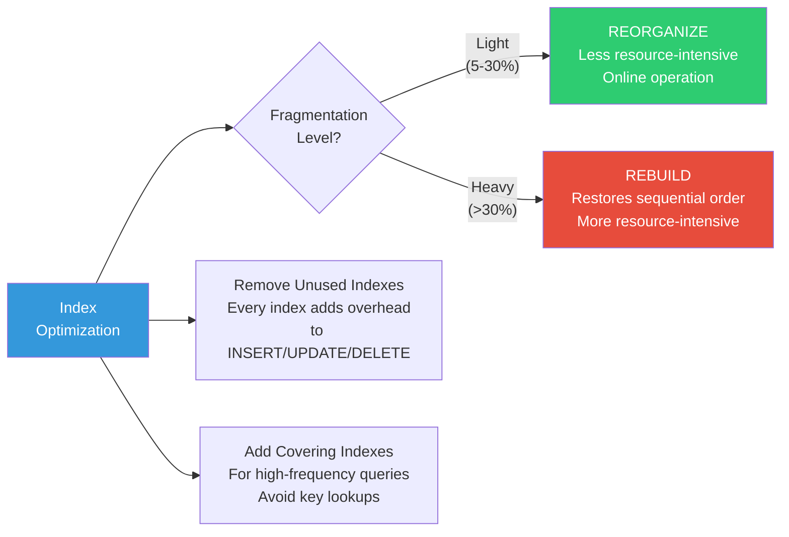

### Patch Management

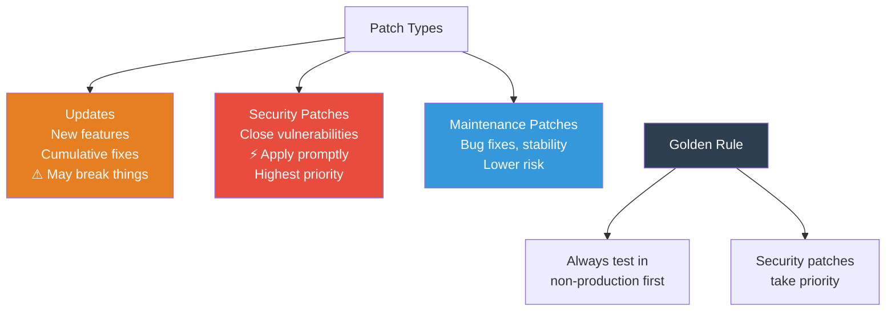

### Change Management — Ordered Process

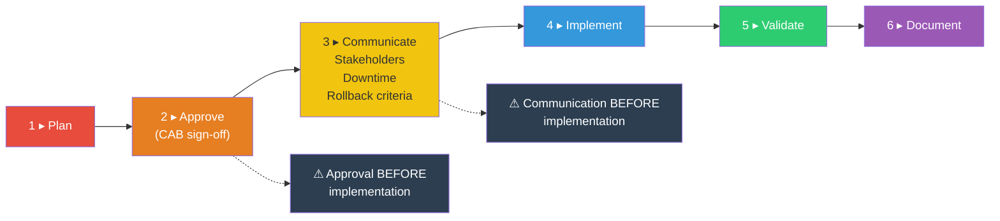

### Documentation Types

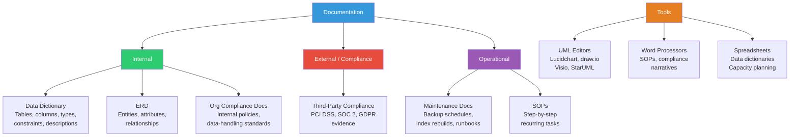

### View vs Materialized View

```mermaid
flowchart LR
    subgraph VIEW["VIEW"]
        direction TB
        V1["Virtual table"]
        V2["No data stored"]
        V3["Always current"]
        V4["Runs SELECT every time"]
        V5["Best for: simplifying access,\nrestricting columns"]
    end

    subgraph MATVIEW["MATERIALIZED VIEW"]
        direction TB
        M1["Physically stored snapshot"]
        M2["Data stored on disk"]
        M3["Stale until refreshed"]
        M4["Precomputed results"]
        M5["Best for: expensive aggregations\nqueried frequently"]
    end

    VIEW ~~~ MATVIEW

    style VIEW fill:#3498db,color:#fff
    style MATVIEW fill:#e74c3c,color:#fff
```

---

## Domain 4 — Data & Database Security (23%)

### Encryption — Data States

```mermaid
flowchart TD
    ENC["Encryption"] --> TRANSIT["Data in Transit\n(Moving across network)"]
    ENC --> REST["Data at Rest\n(Stored on disk)"]

    TRANSIT --> CSE["Client-Side Encryption\nApp encrypts before sending"]
    TRANSIT --> ITE["In-Transit Encryption\nTLS/SSL channel"]
    TRANSIT --> SSE["Server-Side Encryption\nServer encrypts on receipt"]

    REST --> TDE["Transparent Data\nEncryption (TDE)\nEncrypts DB files\nQueries see plaintext"]
    REST --> CLE["Column-Level\nEncryption\nGranular, specific columns\nHigher app complexity"]
    REST --> FDE["Full-Disk Encryption\nOS-level (BitLocker, LUKS)\nEntire volume"]

    style ENC fill:#2c3e50,color:#fff
    style TRANSIT fill:#3498db,color:#fff
    style REST fill:#e74c3c,color:#fff
```

### Data Masking

```mermaid
flowchart LR
    subgraph STATIC["Static Masking"]
        direction TB
        S1["Applied to non-production\ncopies"]
        S2["Permanent alteration"]
        S3["Production data unchanged"]
        S4["Use: safe dev/test\nenvironments"]
    end

    subgraph DYNAMIC["Dynamic Masking"]
        direction TB
        D1["Applied at query time\nin production"]
        D2["Production data unchanged"]
        D3["Role-based: different users\nsee different levels"]
        D4["Use: role-based access\nin production"]
    end

    DISC["Data Discovery\n(must happen FIRST)\nScan to find\nPII, PHI, PCI data"]
    DISC --> STATIC
    DISC --> DYNAMIC

    style STATIC fill:#3498db,color:#fff
    style DYNAMIC fill:#9b59b6,color:#fff
    style DISC fill:#e74c3c,color:#fff
```

### Data Destruction Techniques

```mermaid
flowchart LR
    DEST["Data\nDestruction"] --> LOG["Logical Deletion\nSoft delete\n(mark as deleted)\nRecoverable"]
    DEST --> PHYS["Physical Deletion\nDELETE / TRUNCATE\nRecoverable from\nbackups/forensics"]
    DEST --> CRYPTO["Cryptographic Erasure\nDestroy encryption key\nData permanently\nunreadable"]
    DEST --> MEDIA["Media Sanitization\nDegaussing, overwriting\nPhysical destruction"]

    LOG -.->|"Least permanent"| PHYS -.->|"More permanent"| CRYPTO -.->|"Most permanent"| MEDIA

    style LOG fill:#2ecc71,color:#fff
    style PHYS fill:#f1c40f,color:#333
    style CRYPTO fill:#e67e22,color:#fff
    style MEDIA fill:#e74c3c,color:#fff
```

### Data Classification

```mermaid
flowchart TD
    CLASS["Data Classification"] --> PII
    CLASS --> PHI
    CLASS --> PCI

    PII["PII\nPersonally Identifiable\nInformation"]
    PII --> PII_D["Name, SSN, email\naddress, date of birth"]
    PII --> PII_G["Governed by: various\nstate/federal privacy laws"]

    PHI["PHI\nPersonal Health\nInformation"]
    PHI --> PHI_D["Medical records, diagnoses\ninsurance IDs"]
    PHI --> PHI_G["Governed by: HIPAA"]

    PCI["PCI DSS\nPayment Card Industry\nData Security Standard"]
    PCI --> PCI_D["Card number, CVV\ncardholder name, expiration"]
    PCI --> PCI_G["Governed by: PCI SSC\nQuarterly scans required"]

    style PII fill:#3498db,color:#fff
    style PHI fill:#2ecc71,color:#fff
    style PCI fill:#e67e22,color:#fff
```

### Access Control — Decision Flow

```mermaid
flowchart TD
    START["User needs\naccess"] --> Q1{"What does the\nuser need to do?"}

    Q1 -->|"Read data"| SEL["Grant SELECT only"]
    Q1 -->|"Modify data"| DML_P["Grant INSERT /\nUPDATE / DELETE"]
    Q1 -->|"Manage schema"| DDL_P["Grant DDL\npermissions"]

    SEL --> ROLE["Assign via ROLE\n(e.g., read_only_analysts)"]
    DML_P --> ROLE
    DDL_P --> ROLE

    ROLE --> LP["Apply LEAST PRIVILEGE\nNever grant db_owner\nor sysadmin for\nroutine tasks"]

    LP --> REVIEW["Periodic Review\nRemove expired accounts\nRotate service account\npasswords"]

    PWD["Password Policies"]
    PWD --> COMP["Complexity\nMin length + char mix"]
    PWD --> EXP["Expiration\nRotate every 90 days"]
    PWD --> HIST["History\nPrevent reuse"]
    PWD --> LOCK["Lockout\nAfter N failed attempts"]

    style START fill:#3498db,color:#fff
    style LP fill:#e74c3c,color:#fff
    style ROLE fill:#2ecc71,color:#fff
    style PWD fill:#9b59b6,color:#fff
```

### Infrastructure Security — Physical + Logical

```mermaid
flowchart TD
    SEC["Infrastructure\nSecurity"] --> PHYS["Physical Security"]
    SEC --> LOGIC["Logical Security"]

    PHYS --> AC["Access Control\nLocked rooms\nBadge readers\nMantraps"]
    PHYS --> BIO["Biometrics\nFingerprint\nRetinal scan"]
    PHYS --> SURV["Surveillance\nCCTV cameras\nForensic review"]
    PHYS --> FIRE["Fire Suppression\nClean-agent (FM-200)\nSmoke detection"]
    PHYS --> COOL["Cooling Systems\nHVAC\nPrecision cooling"]

    LOGIC --> FW["Firewall\nFilter by IP, port,\nprotocol"]
    LOGIC --> DMZ["Perimeter Network\n(DMZ)\nWeb servers here\n⚠ DB NEVER here"]
    LOGIC --> PORT["Port Security\nClose unused ports\nChange defaults"]

    style PHYS fill:#e74c3c,color:#fff
    style LOGIC fill:#3498db,color:#fff
    style DMZ fill:#e67e22,color:#fff
```

### Attack Types & Mitigations

```mermaid
flowchart TD
    ATK["Attacks on\nData Systems"] --> SQLI & DOS & ONPATH & BRUTE & PHISH & RANSOM

    SQLI["SQL Injection\n' OR 1=1 --\nTargets DB through app"]
    SQLI --> SQLI_M["✦ Parameterized queries\n✦ Input validation\n✦ Least-privilege accounts\n✦ WAF"]

    DOS["Denial of Service\nOverwhelm with\ntraffic/requests"]
    DOS --> DOS_M["✦ Rate limiting\n✦ Connection throttling\n✦ Load balancing"]

    ONPATH["On-Path\n(Man-in-the-Middle)\nIntercepts client↔server"]
    ONPATH --> ONPATH_M["✦ TLS/SSL encryption\n✦ Certificate pinning\n✦ Mutual authentication"]

    BRUTE["Brute Force\nAutomated repeated\nlogin attempts"]
    BRUTE --> BRUTE_M["✦ Account lockout\n✦ Strong passwords\n✦ MFA"]

    PHISH["Phishing\nSocial engineering\nFake emails/websites"]
    PHISH --> PHISH_M["✦ Security training\n✦ MFA\n✦ Email filtering"]

    RANSOM["Ransomware\nEncrypts DB files\nDemands payment"]
    RANSOM --> RANSOM_M["✦ Offline/immutable backups\n✦ Endpoint protection\n✦ Network segmentation"]

    style ATK fill:#2c3e50,color:#fff
    style SQLI fill:#e74c3c,color:#fff
    style DOS fill:#e67e22,color:#fff
    style ONPATH fill:#f39c12,color:#fff
    style BRUTE fill:#9b59b6,color:#fff
    style PHISH fill:#3498db,color:#fff
    style RANSOM fill:#1abc9c,color:#fff
```

---

## Domain 5 — Business Continuity (12%)

### DR Techniques — RPO / RTO Comparison

```mermaid
flowchart TD
    DR["DR Techniques"] --> SYNC & ASYNC & LOGSHIP & HA

    SYNC["Synchronous\nReplication / Mirroring\n───────\nRPO: Near-zero\nRTO: Seconds\n⚠ Adds write latency\n(waits for ack)"]

    ASYNC["Asynchronous\nReplication / Mirroring\n───────\nRPO: Seconds–minutes\nRTO: Seconds–minutes\n✔ Faster writes\n⚠ Risk of recent data loss"]

    LOGSHIP["Log Shipping\n───────\nRPO: Minutes–hours\nRTO: Minutes–hours\n✔ Cheapest\n⚠ Highest data-loss risk"]

    HA["HA Clustering\n───────\nRPO: Near-zero\nRTO: Near-zero\n✔ Minimal downtime\n⚠ Most complex & expensive"]

    style SYNC fill:#2ecc71,color:#fff
    style ASYNC fill:#3498db,color:#fff
    style LOGSHIP fill:#e67e22,color:#fff
    style HA fill:#9b59b6,color:#fff
```

### RPO vs RTO

```mermaid
flowchart LR
    subgraph RPO_BOX["RPO — Recovery Point Objective"]
        direction TB
        RPO_Q["'How much data can we lose?'"]
        RPO_D["Drives BACKUP FREQUENCY\nRPO = 1 hour → backups\nat least every hour"]
    end

    subgraph RTO_BOX["RTO — Recovery Time Objective"]
        direction TB
        RTO_Q["'How fast must we recover?'"]
        RTO_D["Drives ARCHITECTURE\nRTO = minutes → HA / hot standby\nCold restore won't meet it"]
    end

    RPO_BOX ~~~ RTO_BOX

    style RPO_BOX fill:#e74c3c,color:#fff
    style RTO_BOX fill:#3498db,color:#fff
```

### Backup Types Comparison

```mermaid
flowchart TD
    FULL["FULL Backup\n───────\nCaptures: entire database\nRestore: full only (1 file)\nSpeed: fastest restore\nSize: largest"]

    DIFF["DIFFERENTIAL Backup\n───────\nCaptures: changes since\nlast FULL\nRestore: full + latest diff\n(2 files)\nGrows between fulls"]

    INCR["INCREMENTAL Backup\n───────\nCaptures: changes since\nlast backup (any type)\nRestore: full + EVERY incr\nin sequence (N files)\nSmallest individual files"]

    FULL -->|"Base for"| DIFF
    FULL -->|"Base for"| INCR
    DIFF -.->|"References"| FULL
    INCR -.->|"References"| PREV["Previous backup\n(full or incremental)"]

    TRAP["⚠ EXAM TRAP\nDifferential = since last FULL\nIncremental = since last BACKUP\nDiff restore = 2 files (simpler)\nIncr restore = N files (slowest)"]

    style FULL fill:#2ecc71,color:#fff
    style DIFF fill:#3498db,color:#fff
    style INCR fill:#e67e22,color:#fff
    style TRAP fill:#e74c3c,color:#fff
```

### Backup Best Practices

```mermaid
flowchart TD
    BP["Backup Best\nPractices"] --> SCHED["Schedule & Automate\nFull → Diff/Incr → Log\nAlign with RPO"]
    BP --> TEST["Test Restores\nA backup never restored\nis a hope, not a backup"]
    BP --> HASH["Validate Hash\nSHA-256 / MD5 at creation\nCompare before restore\nMismatch = corruption"]
    BP --> LOC["Storage Location"]
    BP --> RET["Retention Policy"]

    LOC --> ONSITE["On-Site\n✔ Fast restore\n✘ Same disaster risk"]
    LOC --> OFFSITE["Off-Site\n✔ Survives local disaster\n✘ Slower restore"]
    LOC --> RULE["3-2-1 Rule\n3 copies\n2 media types\n1 off-site"]

    RET --> PURGE["Purge\nDelete after retention\nperiod expires"]
    RET --> ARCHIVE["Archive\nMove to cold storage\nFor regulatory holds"]

    style BP fill:#3498db,color:#fff
    style RULE fill:#e74c3c,color:#fff
```

### Failback to Normal Operations — Ordered Process

```mermaid
flowchart TD
    F1["1 ▸ Verify primary\nenvironment restored\nand healthy"]
    F2["2 ▸ Resynchronize data\nfrom DR site\nto primary"]
    F3["3 ▸ Validate data integrity\nRow counts, checksums,\nreferential integrity"]
    F4["4 ▸ Switch traffic to primary\nDNS change,\nconnection strings,\nload balancer"]
    F5["5 ▸ Monitor for stability\nDefined observation\nperiod"]
    F6["6 ▸ Update DR documentation\nLessons learned"]

    F1 --> F2 --> F3 --> F4 --> F5 --> F6

    style F1 fill:#e74c3c,color:#fff
    style F2 fill:#e67e22,color:#fff
    style F3 fill:#f1c40f,color:#333
    style F4 fill:#3498db,color:#fff
    style F5 fill:#2ecc71,color:#fff
    style F6 fill:#9b59b6,color:#fff
```

### DR Plan Testing Types

```mermaid
flowchart LR
    TT["DR Testing"] --> TAB["Tabletop Exercise\n───────\nWalk-through on paper\n✔ Low cost\n✔ Catches procedural gaps\n✘ No technical validation"]
    TT --> SIM["Simulation\n───────\nSimulate failure\nin test environment\n✔ Validates technical steps\n✔ Medium cost"]
    TT --> FULL["Full Failover Test\n───────\nActually fail over\nto DR site\n✔ Highest confidence\n⚠ Highest risk & cost"]

    style TAB fill:#2ecc71,color:#fff
    style SIM fill:#3498db,color:#fff
    style FULL fill:#e74c3c,color:#fff
```

---

## Cross-Domain — Key Distinctions

### TRUNCATE vs DELETE

```mermaid
flowchart LR
    subgraph TRUNC["TRUNCATE"]
        direction TB
        T1["DDL statement"]
        T2["Removes ALL rows"]
        T3["Cannot use WHERE"]
        T4["Minimal logging"]
        T5["Faster"]
        T6["Keeps table structure"]
    end

    subgraph DEL["DELETE"]
        direction TB
        D1["DML statement"]
        D2["Can remove specific rows"]
        D3["Uses WHERE clause"]
        D4["Fully logged"]
        D5["Slower (row-by-row)"]
        D6["Can fire triggers"]
    end

    TRUNC ~~~ DEL

    style TRUNC fill:#e74c3c,color:#fff
    style DEL fill:#3498db,color:#fff
```

### Relational vs NoSQL — Quick Reference

```mermaid
flowchart LR
    subgraph RSQL["Relational (SQL)"]
        direction TB
        R1["Schema-on-write"]
        R2["Vertical scaling"]
        R3["Full ACID"]
        R4["Foreign keys + JOINs"]
        R5["Structured, transactional"]
        R6["Regulatory compliance"]
    end

    subgraph NOSQL["NoSQL"]
        direction TB
        N1["Schema-on-read"]
        N2["Horizontal scaling"]
        N3["Eventual consistency (BASE)"]
        N4["Denormalized"]
        N5["High velocity / volume"]
        N6["Semi/unstructured data"]
    end

    RSQL ~~~ NOSQL

    style RSQL fill:#3498db,color:#fff
    style NOSQL fill:#e74c3c,color:#fff
```

### Security Audit Checklist — Ordered Process

```mermaid
flowchart TD
    SA1["1 ▸ Check expired / dormant accounts"]
    SA2["2 ▸ Review connection request logs"]
    SA3["3 ▸ Audit SQL code for injection vulnerabilities"]
    SA4["4 ▸ Verify credential storage\n(no plaintext, no hardcoded strings)"]
    SA5["5 ▸ Confirm password policies enforced"]
    SA6["6 ▸ Validate least privilege on\nall service accounts"]

    SA1 --> SA2 --> SA3 --> SA4 --> SA5 --> SA6

    style SA1 fill:#e74c3c,color:#fff
    style SA2 fill:#e67e22,color:#fff
    style SA3 fill:#f1c40f,color:#333
    style SA4 fill:#3498db,color:#fff
    style SA5 fill:#2ecc71,color:#fff
    style SA6 fill:#9b59b6,color:#fff
```

### Concept Thread Map — Where Topics Appear Across Domains

```mermaid
flowchart LR
    subgraph D1["Domain 1\nFundamentals"]
        D1_A["SQL syntax\nProgramming objects\nSchema levels\nERD & Data Dict"]
    end

    subgraph D2["Domain 2\nDeployment"]
        D2_A["Build physical schema\nPrerequisites\nConnectivity\nTesting"]
    end

    subgraph D3["Domain 3\nMaintenance"]
        D3_A["Monitor & alert\nOptimize indexes\nChange management\nDocumentation"]
    end

    subgraph D4["Domain 4\nSecurity"]
        D4_A["Encryption\nAccess control\nCompliance\nAttack types"]
    end

    subgraph D5["Domain 5\nContinuity"]
        D5_A["DR techniques\nBackup types\nRPO/RTO\nFailover/failback"]
    end

    D1 --> D2 --> D3
    D3 --> D4
    D3 --> D5
    D4 --> D5

    style D1 fill:#e67e22,color:#fff
    style D2 fill:#3498db,color:#fff
    style D3 fill:#e74c3c,color:#fff
    style D4 fill:#e67e22,color:#fff
    style D5 fill:#3498db,color:#fff
```

### Default Database Ports — Quick Reference

```mermaid
flowchart LR
    PORTS["Default\nDB Ports"] --> SQL["SQL Server\n1433/TCP"]
    PORTS --> MY["MySQL\n3306/TCP"]
    PORTS --> PG["PostgreSQL\n5432/TCP"]
    PORTS --> MG["MongoDB\n27017/TCP"]

    style PORTS fill:#2c3e50,color:#fff
    style SQL fill:#e74c3c,color:#fff
    style MY fill:#3498db,color:#fff
    style PG fill:#2ecc71,color:#fff
    style MG fill:#9b59b6,color:#fff
```
