# CompTIA DataSys+ DS0-001 Visual Study Diagrams

All diagrams use [Mermaid](https://mermaid.js.org/) syntax — renders natively in GitHub, VS Code (with Markdown Preview Mermaid extension), and most modern Markdown viewers.

---

## Exam Overview

### Domain Weight Distribution

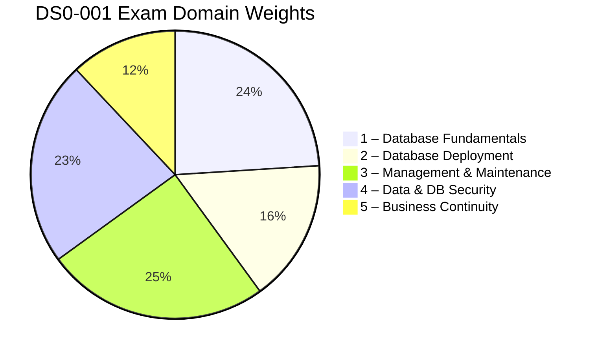

### Study Path

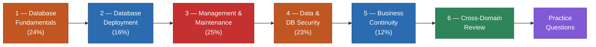

### Objective Verb → Question Style

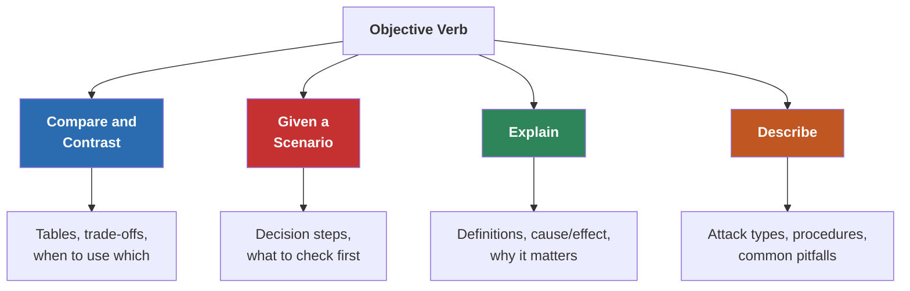

---

## Domain 1 — Database Fundamentals (24%)

### Database Type Taxonomy

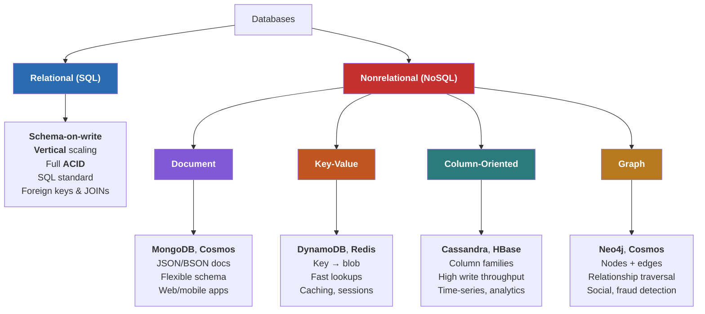

### Linear vs Non-Linear Data Formats

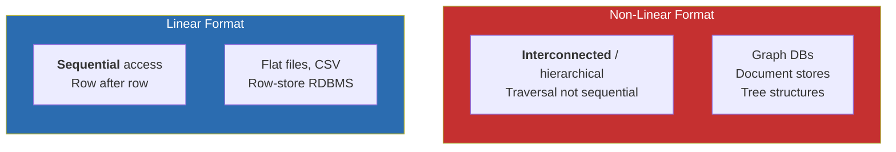

### SQL Sublanguages

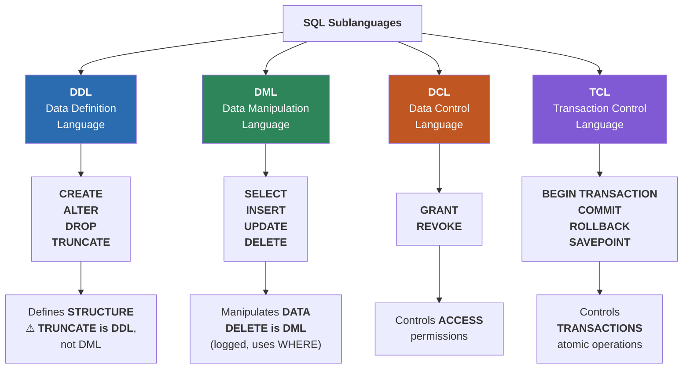

### ACID Properties

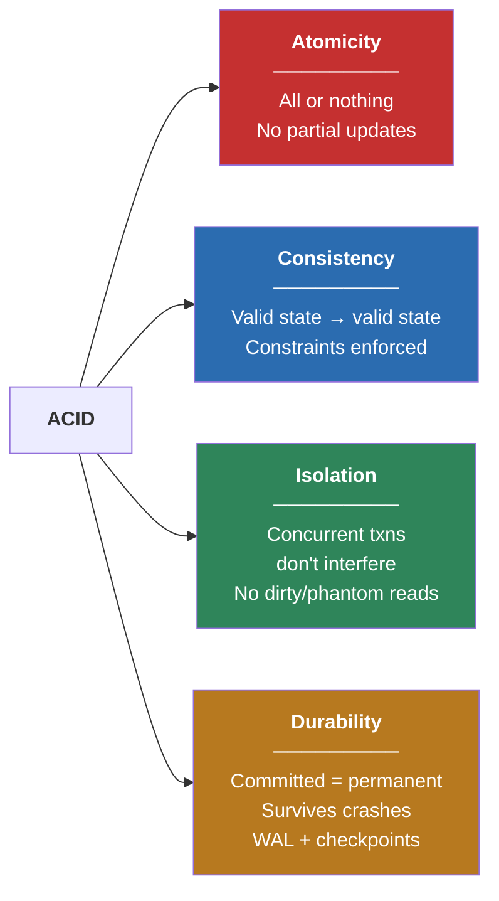

### SQL Programming Objects — Decision Flowchart

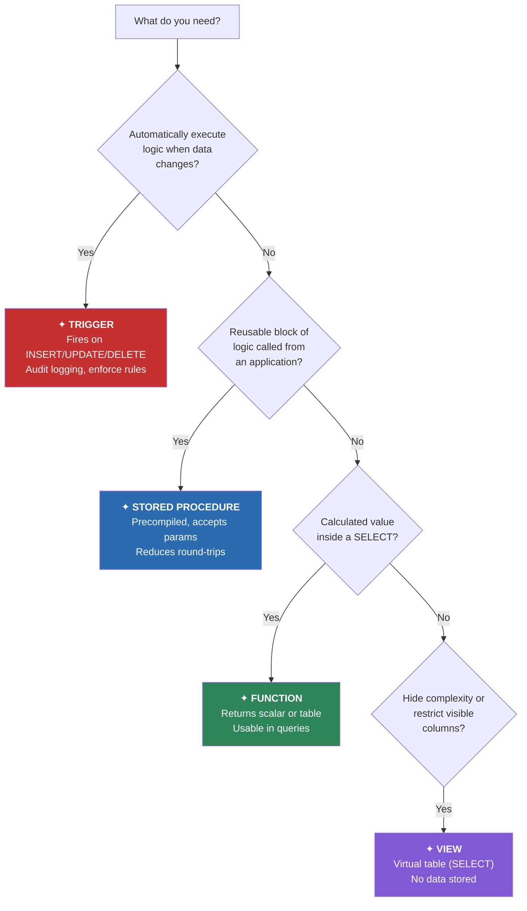

### ORM Impact Assessment — Ordered Process

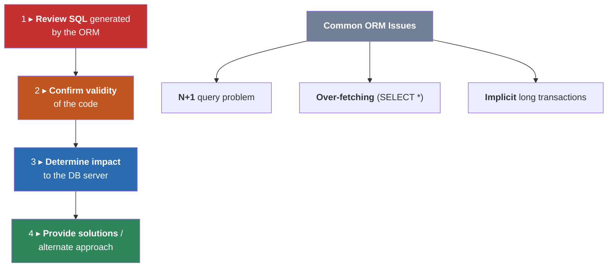

### Server-Side vs Client-Side Scripting

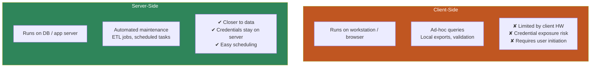

### Database Planning & Design

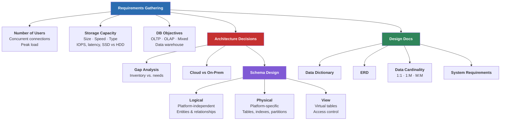

---

## Domain 2 — Database Deployment (16%)

### Cloud Hosting Models — Who Manages What?

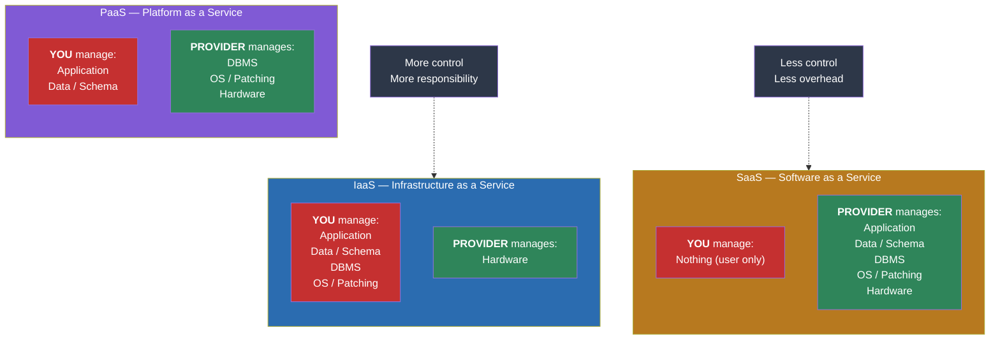

### Deployment Phases — Ordered Process

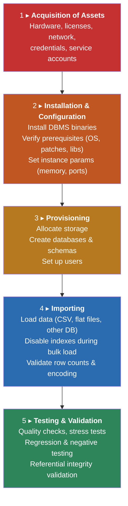

### Database Connectivity Architecture

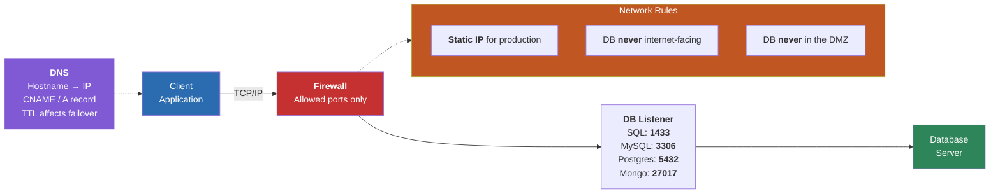

### Testing & Validation Types

```mermaid
flowchart TD
    TEST["<b>Testing</b>"] --> QC["<b>DB Quality Check</b><br/>Columns/tables match spec"]
    TEST --> CE["<b>Code Execution</b><br/>Procs, functions, triggers"]
    TEST --> SM["<b>Schema Meets</b><br/>Requirements"]
    TEST --> SYN["<b>Syntax Errors</b><br/>Scripts parse cleanly"]
    TEST --> STR["<b>Stress Testing</b><br/>Proc stress + app load"]
    TEST --> NT["<b>Notification Triggers</b><br/>Alerts fire correctly"]
    TEST --> VC["<b>Version Control</b><br/>Migrations apply clean"]
    TEST --> REG["<b>Regression Testing</b><br/>Existing features work"]
    TEST --> NEG["<b>Negative Testing</b><br/>⚠ Bad data handled<br/>gracefully"]

    VAL["<b>Validation</b>"] --> IDX["<b>Index Analysis</b>"]
    VAL --> DM["<b>Data Mapping</b><br/>Source → target"]
    VAL --> DV["<b>Data Values</b><br/>NULLs, truncation, encoding"]
    VAL --> QR["<b>Queries</b><br/>Correct results, good perf"]
    VAL --> RI["<b>Referential Integrity</b><br/>No orphan records"]
    VAL --> SV["<b>Scalability</b><br/>Handles projected growth"]

    style TEST fill:#2B6CB0,color:#fff
    style VAL fill:#2F855A,color:#fff
    style NEG fill:#C53030,color:#fff
```

---

## Domain 3 — Management & Maintenance (25%)

### Monitoring & Alerting Overview

```mermaid
flowchart TD
    MON["<b>Database Monitoring</b>"] --> RES["<b>Resource Utilization</b>"]
    MON --> PERF["<b>Performance</b>"]
    MON --> JOBS["<b>Job Monitoring</b>"]
    MON --> SEC["<b>Security Signals</b>"]
    MON --> REP["<b>Replication</b>"]

    RES --> CPU["<b>CPU</b><br/>Sustained high =<br/>missing indexes or<br/>bad plans"]
    RES --> MEM["<b>Memory</b><br/>Buffer pool hit ratio<br/>Page life expectancy"]
    RES --> DISK["<b>Disk Space</b><br/>I/O latency<br/>Queue depth"]
    RES --> OS["<b>OS Performance</b><br/>Context switches<br/>Page faults"]

    PERF --> TP["<b>Throughput</b><br/>TPS / QPS"]
    PERF --> DU["<b>Daily Usage</b><br/>Establish baseline<br/>Spot deviations"]
    PERF --> GR["<b>Growth Trends</b><br/>Storage limits<br/>Capacity planning"]

    JOBS --> JC["<b>Job Completion</b><br/>Backups, ETL,<br/>index rebuilds"]
    JOBS --> BAK["<b>Backup Alerts</b><br/>Missed / failed / slow<br/>File size anomalies"]
    JOBS --> LOGS["<b>Log Files</b><br/>Transaction logs<br/>System logs"]

    SEC --> DL["<b>Deadlocks</b><br/>Frequency & objects<br/>Design issues"]
    SEC --> CONN["<b>Connections</b><br/>Concurrent sessions<br/>Failed attempts"]

    REP --> LAG["<b>Replication Lag</b><br/>Seconds/txns behind"]
    REP --> ERR["<b>Replication Errors</b><br/>Broken chains"]
    REP --> CONS["<b>Data Consistency</b><br/>Primary vs replicas"]

    BL["<b>BASELINE</b><br/>'Normal' metrics snapshot<br/>Required to detect anomalies"]
    BL -.-> MON

    style MON fill:#2B6CB0,color:#fff
    style RES fill:#C53030,color:#fff
    style PERF fill:#C05621,color:#fff
    style JOBS fill:#805AD5,color:#fff
    style SEC fill:#2C7A7B,color:#fff
    style REP fill:#B7791F,color:#fff
    style BL fill:#2D3748,color:#fff
```

### Index Optimization

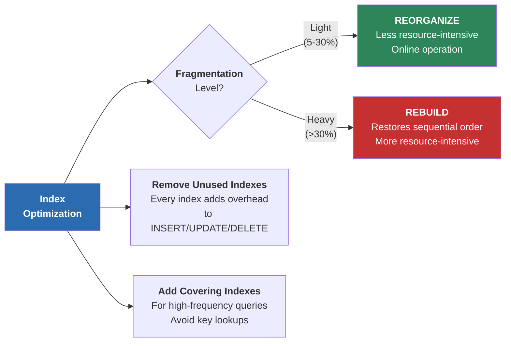

### Patch Management

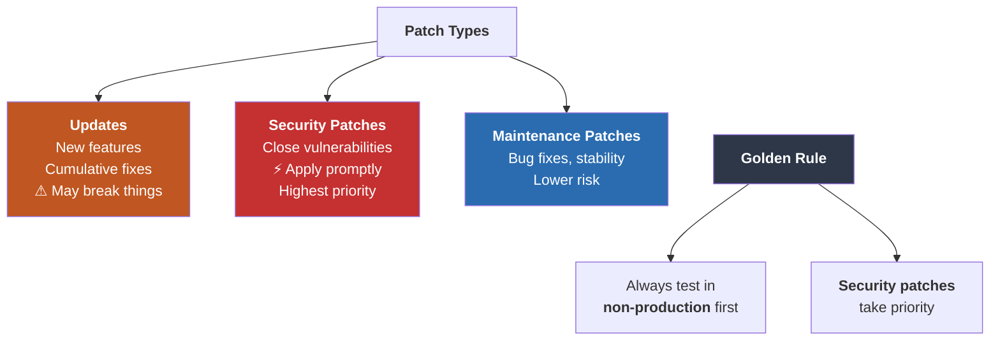

### Change Management — Ordered Process

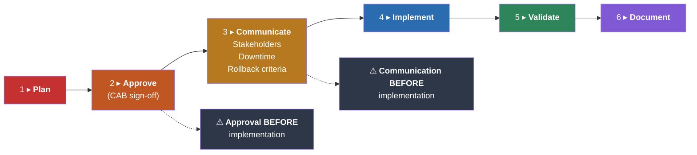

### Documentation Types

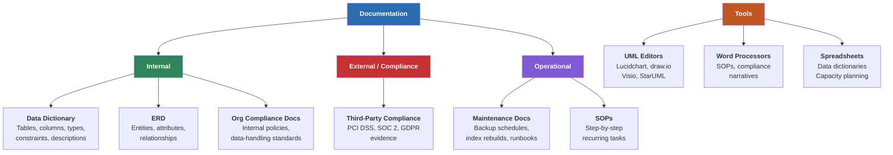

### View vs Materialized View

```mermaid
flowchart LR
    subgraph VIEW["VIEW"]
        direction TB
        V1["<b>Virtual</b> table"]
        V2["<b>No data stored</b>"]
        V3["<b>Always current</b>"]
        V4["Runs SELECT every time"]
        V5["Best for: simplifying access,<br/>restricting columns"]
    end

    subgraph MATVIEW["MATERIALIZED VIEW"]
        direction TB
        M1["<b>Physically stored</b> snapshot"]
        M2["Data stored on disk"]
        M3["<b>Stale until refreshed</b>"]
        M4["Precomputed results"]
        M5["Best for: expensive aggregations<br/>queried frequently"]
    end

    VIEW ~~~ MATVIEW

    style VIEW fill:#2B6CB0,color:#fff
    style MATVIEW fill:#C53030,color:#fff
```

---

## Domain 4 — Data & Database Security (23%)

### Encryption — Data States

```mermaid
flowchart TD
    ENC["<b>Encryption</b>"] --> TRANSIT["<b>Data in Transit</b><br/>(Moving across network)"]
    ENC --> REST["<b>Data at Rest</b><br/>(Stored on disk)"]

    TRANSIT --> CSE["<b>Client-Side Encryption</b><br/>App encrypts before sending"]
    TRANSIT --> ITE["<b>In-Transit Encryption</b><br/>TLS/SSL channel"]
    TRANSIT --> SSE["<b>Server-Side Encryption</b><br/>Server encrypts on receipt"]

    REST --> TDE["<b>Transparent Data<br/>Encryption (TDE)</b><br/>Encrypts DB files<br/>Queries see plaintext"]
    REST --> CLE["<b>Column-Level<br/>Encryption</b><br/>Granular, specific columns<br/>Higher app complexity"]
    REST --> FDE["<b>Full-Disk Encryption</b><br/>OS-level (BitLocker, LUKS)<br/>Entire volume"]

    style ENC fill:#2D3748,color:#fff
    style TRANSIT fill:#2B6CB0,color:#fff
    style REST fill:#C53030,color:#fff
```

### Data Masking

```mermaid
flowchart LR
    subgraph STATIC["Static Masking"]
        direction TB
        S1["Applied to <b>non-production</b><br/>copies"]
        S2["<b>Permanent</b> alteration"]
        S3["Production data unchanged"]
        S4["Use: safe <b>dev/test</b><br/>environments"]
    end

    subgraph DYNAMIC["Dynamic Masking"]
        direction TB
        D1["Applied <b>at query time</b><br/>in production"]
        D2["Production data unchanged"]
        D3["<b>Role-based</b>: different users<br/>see different levels"]
        D4["Use: <b>role-based access</b><br/>in production"]
    end

    DISC["<b>Data Discovery</b><br/>(must happen <b>FIRST</b>)<br/>Scan to find<br/>PII, PHI, PCI data"]
    DISC --> STATIC
    DISC --> DYNAMIC

    style STATIC fill:#2B6CB0,color:#fff
    style DYNAMIC fill:#805AD5,color:#fff
    style DISC fill:#C53030,color:#fff
```

### Data Destruction Techniques

```mermaid
flowchart LR
    DEST["<b>Data<br/>Destruction</b>"] --> LOG["<b>Logical Deletion</b><br/>Soft delete<br/>(mark as deleted)<br/>Recoverable"]
    DEST --> PHYS["<b>Physical Deletion</b><br/>DELETE / TRUNCATE<br/>Recoverable from<br/>backups/forensics"]
    DEST --> CRYPTO["<b>Cryptographic Erasure</b><br/>Destroy encryption key<br/>Data permanently<br/>unreadable"]
    DEST --> MEDIA["<b>Media Sanitization</b><br/>Degaussing, overwriting<br/>Physical destruction"]

    LOG -.->|"Least permanent"| PHYS -.->|"More permanent"| CRYPTO -.->|"Most permanent"| MEDIA

    style LOG fill:#2F855A,color:#fff
    style PHYS fill:#B7791F,color:#fff
    style CRYPTO fill:#C05621,color:#fff
    style MEDIA fill:#C53030,color:#fff
```

### Data Classification

```mermaid
flowchart TD
    CLASS["<b>Data Classification</b>"] --> PII
    CLASS --> PHI
    CLASS --> PCI

    PII["<b>PII</b><br/>Personally Identifiable<br/>Information"]
    PII --> PII_D["Name, SSN, email<br/>address, date of birth"]
    PII --> PII_G["Governed by: <b>various<br/>state/federal privacy laws</b>"]

    PHI["<b>PHI</b><br/>Personal Health<br/>Information"]
    PHI --> PHI_D["Medical records, diagnoses<br/>insurance IDs"]
    PHI --> PHI_G["Governed by: <b>HIPAA</b>"]

    PCI["<b>PCI DSS</b><br/>Payment Card Industry<br/>Data Security Standard"]
    PCI --> PCI_D["Card number, CVV<br/>cardholder name, expiration"]
    PCI --> PCI_G["Governed by: <b>PCI SSC</b><br/>Quarterly scans required"]

    style PII fill:#2B6CB0,color:#fff
    style PHI fill:#2F855A,color:#fff
    style PCI fill:#C05621,color:#fff
```

### Access Control — Decision Flow

```mermaid
flowchart TD
    START["User needs<br/>access"] --> Q1{"What does the<br/>user need to do?"}

    Q1 -->|"Read data"| SEL["Grant <b>SELECT</b> only"]
    Q1 -->|"Modify data"| DML_P["Grant <b>INSERT</b> /<br/><b>UPDATE</b> / <b>DELETE</b>"]
    Q1 -->|"Manage schema"| DDL_P["Grant <b>DDL</b><br/>permissions"]

    SEL --> ROLE["Assign via <b>ROLE</b><br/>(e.g., read_only_analysts)"]
    DML_P --> ROLE
    DDL_P --> ROLE

    ROLE --> LP["Apply <b>LEAST PRIVILEGE</b><br/>Never grant db_owner<br/>or sysadmin for<br/>routine tasks"]

    LP --> REVIEW["<b>Periodic Review</b><br/>Remove expired accounts<br/>Rotate service account<br/>passwords"]

    PWD["<b>Password Policies</b>"]
    PWD --> COMP["<b>Complexity</b><br/>Min length + char mix"]
    PWD --> EXP["<b>Expiration</b><br/>Rotate every 90 days"]
    PWD --> HIST["<b>History</b><br/>Prevent reuse"]
    PWD --> LOCK["<b>Lockout</b><br/>After N failed attempts"]

    style START fill:#2B6CB0,color:#fff
    style LP fill:#C53030,color:#fff
    style ROLE fill:#2F855A,color:#fff
    style PWD fill:#805AD5,color:#fff
```

### Infrastructure Security — Physical + Logical

```mermaid
flowchart TD
    SEC["<b>Infrastructure<br/>Security</b>"] --> PHYS["<b>Physical Security</b>"]
    SEC --> LOGIC["<b>Logical Security</b>"]

    PHYS --> AC["<b>Access Control</b><br/>Locked rooms<br/>Badge readers<br/>Mantraps"]
    PHYS --> BIO["<b>Biometrics</b><br/>Fingerprint<br/>Retinal scan"]
    PHYS --> SURV["<b>Surveillance</b><br/>CCTV cameras<br/>Forensic review"]
    PHYS --> FIRE["<b>Fire Suppression</b><br/>Clean-agent (FM-200)<br/>Smoke detection"]
    PHYS --> COOL["<b>Cooling Systems</b><br/>HVAC<br/>Precision cooling"]

    LOGIC --> FW["<b>Firewall</b><br/>Filter by IP, port,<br/>protocol"]
    LOGIC --> DMZ["<b>Perimeter Network</b><br/>(DMZ)<br/>Web servers here<br/>⚠ DB <b>NEVER</b> here"]
    LOGIC --> PORT["<b>Port Security</b><br/>Close unused ports<br/>Change defaults"]

    style PHYS fill:#C53030,color:#fff
    style LOGIC fill:#2B6CB0,color:#fff
    style DMZ fill:#C05621,color:#fff
```

### Attack Types & Mitigations

```mermaid
flowchart TD
    ATK["<b>Attacks on<br/>Data Systems</b>"] --> SQLI & DOS & ONPATH & BRUTE & PHISH & RANSOM

    SQLI["<b>SQL Injection</b><br/>' OR 1=1 --<br/>Targets DB through app"]
    SQLI --> SQLI_M["✦ <b>Parameterized queries</b><br/>✦ Input validation<br/>✦ Least-privilege accounts<br/>✦ WAF"]

    DOS["<b>Denial of Service</b><br/>Overwhelm with<br/>traffic/requests"]
    DOS --> DOS_M["✦ <b>Rate limiting</b><br/>✦ Connection throttling<br/>✦ Load balancing"]

    ONPATH["<b>On-Path</b><br/>(Man-in-the-Middle)<br/>Intercepts client↔server"]
    ONPATH --> ONPATH_M["✦ <b>TLS/SSL</b> encryption<br/>✦ Certificate pinning<br/>✦ Mutual authentication"]

    BRUTE["<b>Brute Force</b><br/>Automated repeated<br/>login attempts"]
    BRUTE --> BRUTE_M["✦ <b>Account lockout</b><br/>✦ Strong passwords<br/>✦ MFA"]

    PHISH["<b>Phishing</b><br/>Social engineering<br/>Fake emails/websites"]
    PHISH --> PHISH_M["✦ <b>Security training</b><br/>✦ MFA<br/>✦ Email filtering"]

    RANSOM["<b>Ransomware</b><br/>Encrypts DB files<br/>Demands payment"]
    RANSOM --> RANSOM_M["✦ <b>Offline/immutable backups</b><br/>✦ Endpoint protection<br/>✦ Network segmentation"]

    style ATK fill:#2D3748,color:#fff
    style SQLI fill:#C53030,color:#fff
    style DOS fill:#C05621,color:#fff
    style ONPATH fill:#B7791F,color:#fff
    style BRUTE fill:#805AD5,color:#fff
    style PHISH fill:#2B6CB0,color:#fff
    style RANSOM fill:#2C7A7B,color:#fff
```

---

## Domain 5 — Business Continuity (12%)

### DR Techniques — RPO / RTO Comparison

```mermaid
flowchart TD
    DR["<b>DR Techniques</b>"] --> SYNC & ASYNC & LOGSHIP & HA

    SYNC["<b>Synchronous</b><br/>Replication / Mirroring<br/>───────<br/>RPO: <b>Near-zero</b><br/>RTO: <b>Seconds</b><br/>⚠ Adds write latency<br/>(waits for ack)"]

    ASYNC["<b>Asynchronous</b><br/>Replication / Mirroring<br/>───────<br/>RPO: <b>Seconds–minutes</b><br/>RTO: <b>Seconds–minutes</b><br/>✔ Faster writes<br/>⚠ Risk of recent data loss"]

    LOGSHIP["<b>Log Shipping</b><br/>───────<br/>RPO: <b>Minutes–hours</b><br/>RTO: <b>Minutes–hours</b><br/>✔ Cheapest<br/>⚠ Highest data-loss risk"]

    HA["<b>HA Clustering</b><br/>───────<br/>RPO: <b>Near-zero</b><br/>RTO: <b>Near-zero</b><br/>✔ Minimal downtime<br/>⚠ Most complex & expensive"]

    style SYNC fill:#2F855A,color:#fff
    style ASYNC fill:#2B6CB0,color:#fff
    style LOGSHIP fill:#C05621,color:#fff
    style HA fill:#805AD5,color:#fff
```

### RPO vs RTO

```mermaid
flowchart LR
    subgraph RPO_BOX["RPO — Recovery Point Objective"]
        direction TB
        RPO_Q["<b>'How much data can we lose?'</b>"]
        RPO_D["Drives <b>BACKUP FREQUENCY</b><br/>RPO = 1 hour → backups<br/>at least every hour"]
    end

    subgraph RTO_BOX["RTO — Recovery Time Objective"]
        direction TB
        RTO_Q["<b>'How fast must we recover?'</b>"]
        RTO_D["Drives <b>ARCHITECTURE</b><br/>RTO = minutes → HA / hot standby<br/>Cold restore won't meet it"]
    end

    RPO_BOX ~~~ RTO_BOX

    style RPO_BOX fill:#C53030,color:#fff
    style RTO_BOX fill:#2B6CB0,color:#fff
```

### Backup Types Comparison

```mermaid
flowchart TD
    FULL["<b>FULL</b> Backup<br/>───────<br/>Captures: <b>entire database</b><br/>Restore: full only (<b>1 file</b>)<br/>Speed: <b>fastest</b> restore<br/>Size: largest"]

    DIFF["<b>DIFFERENTIAL</b> Backup<br/>───────<br/>Captures: changes since<br/>last <b>FULL</b><br/>Restore: full + latest diff<br/>(<b>2 files</b>)<br/>Grows between fulls"]

    INCR["<b>INCREMENTAL</b> Backup<br/>───────<br/>Captures: changes since<br/>last <b>backup (any type)</b><br/>Restore: full + EVERY incr<br/>in sequence (<b>N files</b>)<br/>Smallest individual files"]

    FULL -->|"Base for"| DIFF
    FULL -->|"Base for"| INCR
    DIFF -.->|"References"| FULL
    INCR -.->|"References"| PREV["Previous backup<br/>(full or incremental)"]

    TRAP["⚠ <b>EXAM TRAP</b><br/><b>Differential</b> = since last <b>FULL</b><br/><b>Incremental</b> = since last <b>BACKUP</b><br/>Diff restore = <b>2 files</b> (simpler)<br/>Incr restore = <b>N files</b> (slowest)"]

    style FULL fill:#2F855A,color:#fff
    style DIFF fill:#2B6CB0,color:#fff
    style INCR fill:#C05621,color:#fff
    style TRAP fill:#C53030,color:#fff
```

### Backup Best Practices

```mermaid
flowchart TD
    BP["<b>Backup Best<br/>Practices</b>"] --> SCHED["<b>Schedule & Automate</b><br/>Full → Diff/Incr → Log<br/>Align with RPO"]
    BP --> TEST["<b>Test Restores</b><br/>A backup never restored<br/>is a hope, not a backup"]
    BP --> HASH["<b>Validate Hash</b><br/>SHA-256 / MD5 at creation<br/>Compare before restore<br/>Mismatch = corruption"]
    BP --> LOC["<b>Storage Location</b>"]
    BP --> RET["<b>Retention Policy</b>"]

    LOC --> ONSITE["<b>On-Site</b><br/>✔ Fast restore<br/>✘ Same disaster risk"]
    LOC --> OFFSITE["<b>Off-Site</b><br/>✔ Survives local disaster<br/>✘ Slower restore"]
    LOC --> RULE["<b>3-2-1 Rule</b><br/><b>3</b> copies<br/><b>2</b> media types<br/><b>1</b> off-site"]

    RET --> PURGE["<b>Purge</b><br/>Delete after retention<br/>period expires"]
    RET --> ARCHIVE["<b>Archive</b><br/>Move to cold storage<br/>For regulatory holds"]

    style BP fill:#2B6CB0,color:#fff
    style RULE fill:#C53030,color:#fff
```

### Failback to Normal Operations — Ordered Process

```mermaid
flowchart TD
    F1["1 ▸ <b>Verify primary</b><br/>environment restored<br/>and healthy"]
    F2["2 ▸ <b>Resynchronize data</b><br/>from DR site<br/>to primary"]
    F3["3 ▸ <b>Validate data integrity</b><br/>Row counts, checksums,<br/>referential integrity"]
    F4["4 ▸ <b>Switch traffic</b> to primary<br/>DNS change,<br/>connection strings,<br/>load balancer"]
    F5["5 ▸ <b>Monitor for stability</b><br/>Defined observation<br/>period"]
    F6["6 ▸ <b>Update DR documentation</b><br/>Lessons learned"]

    F1 --> F2 --> F3 --> F4 --> F5 --> F6

    style F1 fill:#C53030,color:#fff
    style F2 fill:#C05621,color:#fff
    style F3 fill:#B7791F,color:#fff
    style F4 fill:#2B6CB0,color:#fff
    style F5 fill:#2F855A,color:#fff
    style F6 fill:#805AD5,color:#fff
```

### DR Plan Testing Types

```mermaid
flowchart LR
    TT["<b>DR Testing</b>"] --> TAB["<b>Tabletop Exercise</b><br/>───────<br/>Walk-through on paper<br/>✔ Low cost<br/>✔ Catches procedural gaps<br/>✘ No technical validation"]
    TT --> SIM["<b>Simulation</b><br/>───────<br/>Simulate failure<br/>in test environment<br/>✔ Validates technical steps<br/>✔ Medium cost"]
    TT --> FULL["<b>Full Failover Test</b><br/>───────<br/>Actually fail over<br/>to DR site<br/>✔ Highest confidence<br/>⚠ Highest risk & cost"]

    style TAB fill:#2F855A,color:#fff
    style SIM fill:#2B6CB0,color:#fff
    style FULL fill:#C53030,color:#fff
```

---

## Cross-Domain — Key Distinctions

### TRUNCATE vs DELETE

```mermaid
flowchart LR
    subgraph TRUNC["TRUNCATE"]
        direction TB
        T1["<b>DDL</b> statement"]
        T2["Removes <b>ALL</b> rows"]
        T3["<b>Cannot</b> use WHERE"]
        T4["<b>Minimal</b> logging"]
        T5["Faster"]
        T6["Keeps table structure"]
    end

    subgraph DEL["DELETE"]
        direction TB
        D1["<b>DML</b> statement"]
        D2["Can remove <b>specific</b> rows"]
        D3["<b>Uses WHERE</b> clause"]
        D4["<b>Fully</b> logged"]
        D5["Slower (row-by-row)"]
        D6["Can <b>fire triggers</b>"]
    end

    TRUNC ~~~ DEL

    style TRUNC fill:#C53030,color:#fff
    style DEL fill:#2B6CB0,color:#fff
```

### Relational vs NoSQL — Quick Reference

```mermaid
flowchart LR
    subgraph RSQL["Relational (SQL)"]
        direction TB
        R1["Schema-on-<b>write</b>"]
        R2["<b>Vertical</b> scaling"]
        R3["Full <b>ACID</b>"]
        R4["<b>Foreign keys</b> + JOINs"]
        R5["Structured, transactional"]
        R6["Regulatory compliance"]
    end

    subgraph NOSQL["NoSQL"]
        direction TB
        N1["Schema-on-<b>read</b>"]
        N2["<b>Horizontal</b> scaling"]
        N3["<b>Eventual consistency</b> (BASE)"]
        N4["Denormalized"]
        N5["High velocity / volume"]
        N6["Semi/unstructured data"]
    end

    RSQL ~~~ NOSQL

    style RSQL fill:#2B6CB0,color:#fff
    style NOSQL fill:#C53030,color:#fff
```

### Security Audit Checklist — Ordered Process

```mermaid
flowchart TD
    SA1["1 ▸ Check <b>expired / dormant accounts</b>"]
    SA2["2 ▸ Review <b>connection request logs</b>"]
    SA3["3 ▸ Audit SQL code for <b>injection vulnerabilities</b>"]
    SA4["4 ▸ Verify <b>credential storage</b><br/>(no plaintext, no hardcoded strings)"]
    SA5["5 ▸ Confirm <b>password policies</b> enforced"]
    SA6["6 ▸ Validate <b>least privilege</b> on<br/>all service accounts"]

    SA1 --> SA2 --> SA3 --> SA4 --> SA5 --> SA6

    style SA1 fill:#C53030,color:#fff
    style SA2 fill:#C05621,color:#fff
    style SA3 fill:#B7791F,color:#fff
    style SA4 fill:#2B6CB0,color:#fff
    style SA5 fill:#2F855A,color:#fff
    style SA6 fill:#805AD5,color:#fff
```

### Concept Thread Map — Where Topics Appear Across Domains

```mermaid
flowchart LR
    subgraph D1["Domain 1<br/>Fundamentals"]
        D1_A["SQL syntax<br/>Programming objects<br/>Schema levels<br/>ERD & Data Dict"]
    end

    subgraph D2["Domain 2<br/>Deployment"]
        D2_A["Build physical schema<br/>Prerequisites<br/>Connectivity<br/>Testing"]
    end

    subgraph D3["Domain 3<br/>Maintenance"]
        D3_A["Monitor & alert<br/>Optimize indexes<br/>Change management<br/>Documentation"]
    end

    subgraph D4["Domain 4<br/>Security"]
        D4_A["Encryption<br/>Access control<br/>Compliance<br/>Attack types"]
    end

    subgraph D5["Domain 5<br/>Continuity"]
        D5_A["DR techniques<br/>Backup types<br/>RPO/RTO<br/>Failover/failback"]
    end

    D1 --> D2 --> D3
    D3 --> D4
    D3 --> D5
    D4 --> D5

    style D1 fill:#C05621,color:#fff
    style D2 fill:#2B6CB0,color:#fff
    style D3 fill:#C53030,color:#fff
    style D4 fill:#C05621,color:#fff
    style D5 fill:#2B6CB0,color:#fff
```

### Default Database Ports — Quick Reference

```mermaid
flowchart LR
    PORTS["<b>Default<br/>DB Ports</b>"] --> SQL["<b>SQL Server</b><br/><b>1433</b>/TCP"]
    PORTS --> MY["<b>MySQL</b><br/><b>3306</b>/TCP"]
    PORTS --> PG["<b>PostgreSQL</b><br/><b>5432</b>/TCP"]
    PORTS --> MG["<b>MongoDB</b><br/><b>27017</b>/TCP"]

    style PORTS fill:#2D3748,color:#fff
    style SQL fill:#C53030,color:#fff
    style MY fill:#2B6CB0,color:#fff
    style PG fill:#2F855A,color:#fff
    style MG fill:#805AD5,color:#fff
```
